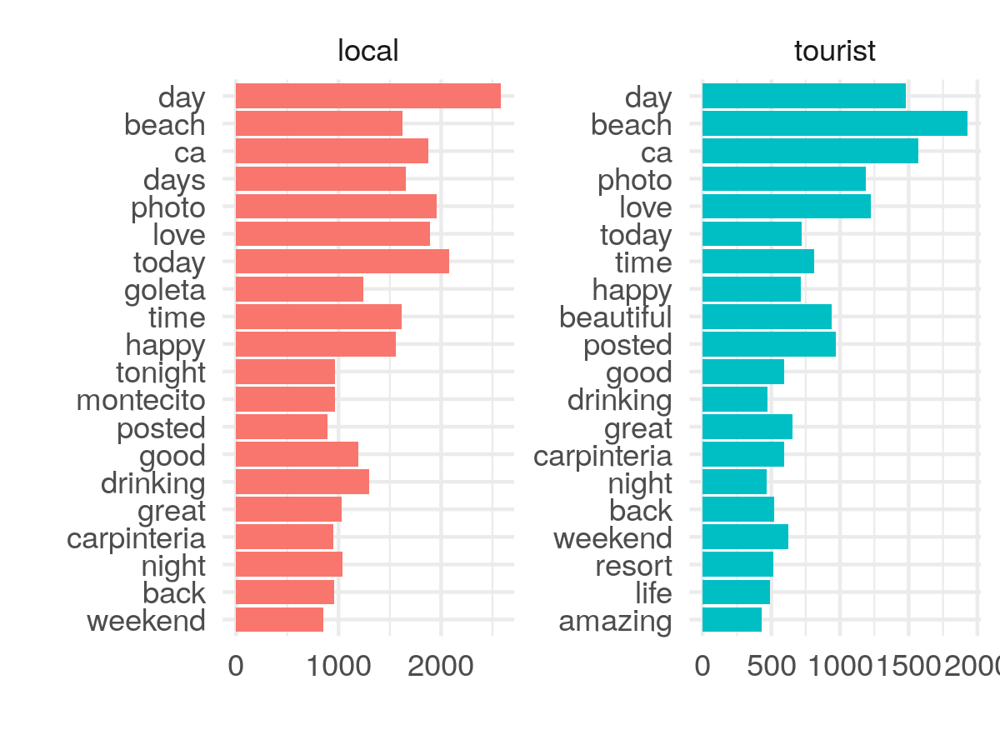

```{r setup, include=FALSE, message = FALSE, warning = FALSE}
knitr::opts_chunk$set(echo = FALSE, message = FALSE, warning = FALSE)

library(mapview)
library(tidyverse)
library(sf)
library(leaflet)
library(kableExtra)
library(sp)
library(ggpol) #for the facet_share function
#library(grid) #for plot.margin
library(RColorBrewer)
library(ggrepel)
library(patchwork)

tweet_data <- read_csv("data/geotagged_sb_tweets.csv")
mapviewOptions(basemaps = c("CartoDB.Positron", "OpenStreetMap"))
```

# Project Summary

Project summary

### Goals  
- Test the feasibility of analyzing location-based social media data to address questions about the scale and context of people’s sense of place
- Conduct at least one of these analyses for Santa Barbara
- Produce a research plan and objectives for a larger project, informed by the results of this proof of concept project, as a way to gauge interest and feasibility of pursuing additional phases of the project.

### Proposed approach
- Examine data availability and accessibility from social media platforms
- Decide on two possible geographies of interest, informed by data availability
- Extract geotagged data for each geography over a determined period of time. This is dependent on data availability but ideally we’d have data over a few years.
- Apply existing methods to reveal patterns of sense of place 
- Analyze data for potential drivers (i.e., variables from the local context that reveal why a place is important) and interactions (e.g., connections between places)
- Communicate results through a blog post and across social media platforms
- Produce a proposal for next steps if this Proof of Concept proves a larger, more robust project is feasible

### Analysis summary
- Roughly **80,000 geotagged tweets** were collected for Santa Barbara from January 1, 2015 to December 31, 2019
- Tourists and locals were defined using a two-step process
- Nature-based tweets were identified using text detection
- 

## Findings
- Tourists tweet more about nature than locals
- spatial patterns on use

## Takeaways
- Social media data is difficult to access for academic research. This data was only available through a UCSB Library partnership with Crimson Hexagon, but still required significant time investment to retrieve and get in a usable format
- 
- We are not pursuing a larger project, but have identified multiple avenues for further research. Project findings will be published in a blog post and shared broadly via social media.


# Analysis

### Data Overview

**Twitter data**

Twitter data was obtained freely through a partnership between UCSB Library and Crimson Hexagon. Before downloading, the data was queried to meet the following conditions:

1. Tweet came from the Santa Barbara area
2. Only original tweets (no retweets)
3. Date was marked between January 1, 2015 and December 31, 2019

Crimson Hexagon only allows 10,000 randomly selected tweets to be exported, manually, at a time in .xls format. Due to this restriction, data was manually downloaded for every 2 days in order to capture all tweets. There were around 5000 average number of daily tweets that met these conditions.

The Crimson Hexagon data did not contain all desired information, including whether or not the tweet was geotagged. To get this information we used the python `twarc` library to "rehydrate" the data using individual tweet ids and store the tweet information as .json files. From here we were able to remove all tweets that did not have a geotag, giving us a total of **79,981** tweets.

#### Table of data

Here is a sample of the type of the final twitter information we obtained.

```{r, echo = FALSE}
kable(sample_n(tweet_data %>% select(-tweet_id, -user_id, -geo_type, -geo_coordinates, -language, -lat, -lon), 7)) %>%
  kable_styling(bootstrap_options = c("striped", "condensed"), font_size = 11, fixed_thead = T)
```

The spatial distribution of tweets highlights areas of higher population density and tourist areas in downtown Santa Barbara. There is a single coordinate that has over 11,000 tweets reported across all years. It is near De La Vina between Islay and Valerio. There is nothing remarkable about this site so I assume it is the default coordinate when people tag "Santa Barbara" generally. The coordinate is 34.4258, -119.714.

```{r num_tweets_w_pic}
tweet_picture_counts <- tweet_data %>%
  filter(!str_detect(full_text, '^"')) %>%
  count(picture = ifelse(str_detect(full_text, "t.co"),
                         "Picture/link", "No picture/link")) %>%
  mutate(prop = round(n/sum(n)*100, 0))
```

Given that the tweet dataset is queried to just those that are geotagged - I hypothesize that most of these tweets have a picture or a link to an instagram post. We can detect links by looking for "t.co" in the tweet which is a twitter URL for a separate webpage. These are often twitter or instagram photos but we can't be 100% certain.

It looks like **`r tweet_picture_counts[2,3]$prop`%** of geotagged tweets contain a link or picture.

```{r, fig.height = 3}
ggplot(tweet_picture_counts, aes(x = picture, y = n, fill = picture)) +
  geom_col() +
  theme_minimal() +
  theme(legend.position = "none") +
  labs(x = "", y = "Number of tweets")
```


#### Interactive map with cluster markers

As you zoom in on the map, clusters will disaggregate. You can click on blue points to see the tweet.

```{r, echo = FALSE, fig.width = 10}
tweet_sf <- tweet_data %>%
  st_as_sf(coords = c("lon", "lat")) %>%
  st_set_crs(4326)

#map
leaflet(tweet_data) %>%
  # Base groups
  addProviderTiles(providers$CartoDB.Positron) %>%
  # Overlay groups %>%
    addCircleMarkers(data = tweet_data, lng = ~lon, lat = ~lat, popup = ~full_text,
                   radius = 3, stroke = FALSE, fillOpacity = 0.5, clusterOptions = markerClusterOptions())
```

#### Tweet density

This is log-transformed. 

```{r, echo = FALSE, fig.width = 10}
hex_grid <- read_sf("data/sb_area_hexagons.shp")

hex_tweet_count <- hex_grid %>%
  mutate(tweet_count = lengths(st_intersects(hex_grid, tweet_sf)),
         log_tweet_count = log(tweet_count))

log_hex_map <-mapview(hex_tweet_count %>% filter(tweet_count > 0), #remove hexes with no tweets
                 zcol = "log_tweet_count", layer.name = "Tweet count (log)")

log_hex_map@map %>% setView(lng = -119.714, lat = 34.426, zoom = 13)
```

#### Timeline of tweets

The number of geotagged tweets is going down over time. There is a significant drop in tweets at the end of April, 2015. It seems this is due "a change in Twitter’s ‘post Tweet’ user-interface design results in fewer Tweets being geo-tagged" ( [source](https://developer.twitter.com/en/docs/tweets/data-dictionary/guides/tweet-timeline)).

```{r}
time_df <- tweet_data %>%
  separate(created_at, into = c("Day", "Year"), sep = 26) %>%
  mutate(Year = as.numeric(Year)) %>%
  separate(Day, into = c("Day", "Date"), sep = 4) %>%
  separate(Date, into = c("Date", "Time"), sep = 7) %>%
  separate(Time, into = c("Time", "Extra"), sep = 9) %>%
  select(-Extra, -tweet_id, -language, -geo_type, -Day) %>%
  separate(Date, into = c("Month", "Day"), sep = " ") %>%
  mutate(Day = as.numeric(Day)) %>%
  mutate(month_num = match(Month,month.abb)) %>%
  mutate(date = as.Date(paste0(month_num, "/", Day, "/",Year), tryFormats = "%m/%d/%Y")) %>%
  group_by(date) %>%
  summarize(count = n())

ggplot(time_df, aes(x = date, y = count)) +
  geom_line() +
  geom_smooth() +
  theme_minimal() +
  labs(x = "",
       y = "Number of geotagged tweets")
```


## Tourists and locals

This project aims to understand if and how preferences differ between tourists and locals for nature-based places within the Santa Barbara area. In order to test this we needed to come up with a way to identify tourists or locals. We used a two step process.

First, if the user has self-identified their location as somewhere in the Santa Barbara area, they are designated a *local*. This includes Carpinteria, Santa Barbara, Montecito, Goleta, Gaviota and UCSB. For the remainder, we use the number of times they have tweeted from Santa Barbara within a year to designate user type. If someone has tweeted across more than 2 months in the same year from Santa Barbara, they are identified as a local. This is consistent with how [Eric Fischer](https://www.citylab.com/transportation/2015/02/where-do-locals-go-in-major-cities-check-out-this-interactive-world-map/385768/) determined tourists in his work. This is not fool-proof and there are instances were people visit and tweet from Santa Barbara more than two months a year, especially if they are visiting family or live within a couple hours driving distance.

```{r, echo = FALSE}
tweet_data_users <- read_csv("data/geotag_sb_tweets_user_type.csv")

tweet_data_users_sf <- tweet_data_users %>%
  st_as_sf(coords = c("lon", "lat")) %>%
  st_set_crs(4326)
```

There are `r nrow(filter(tweet_data_users, user_type == "tourist"))` tweets from tourists and `r nrow(filter(tweet_data_users, user_type == "local"))` tweets from locals.

The following map shows areas that have more tweets from locals (orange) or tourists (purple). Note the values indicate the log10 of the absolute difference between number of tweets from each user group. If a hex is purple and has a value of 2, this means there are 100 times more tweets from tourists than locals at that location.

```{r, echo = FALSE, fig.width = 10}

hex_grid <- read_sf("data/sb_area_hexagons.shp")
locals   <- tweet_data_users_sf %>% filter(user_type == "local")
tourists <- tweet_data_users_sf %>% filter(user_type == "tourist")

hex_tweet_count <- hex_grid %>%
  mutate(local_tweet_count = lengths(st_intersects(hex_grid, locals)),
         local_log_tweet_count = log(local_tweet_count),
         tourist_tweet_count = lengths(st_intersects(hex_grid, tourists))) %>%
  mutate(
         tourist_log_tweet_count = log(tourist_tweet_count),
         total = local_tweet_count + tourist_tweet_count,
         diff = local_tweet_count - tourist_tweet_count)


#where tourists go more
t <- hex_tweet_count %>% 
  filter(diff < 0) %>%
  mutate(value = -1*diff,
         log_value = log10(value))

l <- hex_tweet_count %>%
  filter(diff > 0) %>%
  mutate(log_value = log10(diff))

#map
tl_map <- mapview(t, zcol = "log_value", layer.name = "Tourist preferred # tweets", 
        col.regions = colorRampPalette(brewer.pal(9, "Purples")[4:9]), alpha.regions = 1) +
  mapview(l, zcol = "log_value", layer.name = "Local preferred # tweets", 
        col.regions = colorRampPalette(brewer.pal(9, "Oranges")[4:9]), alpha.regions = 1)

tl_map@map %>% setView(lng = -119.714, lat = 34.426, zoom = 13)
```

## Nature-based tweets

The full text of each tweet was analyzed to be either nature-based or not. We developed a coarse dictionary of words that indicate a nature-based tweet. These include natural features like ocean, coast, park, and works that indicate recreating (fishing, hiking, camping, etc.).

**Note**  
I had a hard time finding an ontology or lexicon that would fit this project. These are definitely skewed more towards nature and recreation rather than words like "home" or "connection".

```{r, echo = FALSE}
dictionary <- read_csv("data/dictionary.csv")
nature_df <- read_csv("data/tweets_nature_categorized.csv")
dictionary$word
```

Let's look at some examples of what tweets qualified as "nature-based".

```{r}
kable(sample_n(nature_df %>% filter(nature_word == 1) %>% select(date, full_text, user_location, user_type, nature_word), 7)) %>%
  kable_styling(bootstrap_options = c("striped", "condensed"), font_size = 11, fixed_thead = T)
```

### Changes over time 

All groups show increases in proportion of tweets that are nature based over time.

```{r, fig.height = 4}
nature_prop <- nature_df %>% 
               group_by(date, nature_word) %>%
               summarize(count = n()) %>%
               ungroup() %>%
               group_by(date) %>%
               mutate(total = sum(count),
                      nature_prop = (count/total)*100) %>%
               filter(nature_word == 1) %>%
               mutate(user_type = "all_tweets")

nature_prop_t <- nature_df %>%
               group_by(date, nature_word, user_type) %>%
               summarize(count = n()) %>%
               ungroup() %>%
               group_by(date, user_type) %>%
               mutate(total = sum(count),
                      nature_prop = (count/total)*100) %>%
               filter(nature_word == 1)

combo <- bind_rows(nature_prop, nature_prop_t)


labels <- data.frame(user_type = c("All tweets", "Tourists", "Locals"), 
                     nature_prop = c(25.6, 36.8, 22.7)) %>%
                     mutate(date = as.Date("2020-03-29"))


ggplot(combo, aes(x = date, y = nature_prop, color = user_type)) +
  geom_smooth(se = F) +
  theme_minimal() +
  labs(x = "",
       y = "Percentage (%) of tweets nature based") +
  theme(legend.position = "none") +
  geom_text(data = labels, aes(x = date, y = nature_prop, label = user_type)) +
  scale_x_date(expand = expand_scale(mult = c(0, 0.1))) +
  scale_colour_manual(values = c("darkgreen","darkgreen", "purple","purple", "orange", "orange"),
                      labels = c("All tweets", "Tourists", "Locals"))
```

### Where are nature-based tweets?

After identifying nature-based tweets we can take a look at where these tweets are coming from and compare to the general pattern of tweets. 

```{r, fig.width = 10}
nature_sf <- nature_df %>%
  st_as_sf(coords = c("lon", "lat")) %>%
  st_set_crs(4326)

hex_tweet_count_nature <- hex_grid %>%
  mutate(tweet_count = lengths(st_intersects(hex_grid, nature_sf %>% filter(nature_word == 1))),
         log_tweet_count = log10(tweet_count))

#color palettes
greens = colorRampPalette(c("#E5F5E0", "#00441B"))

m <- mapview(hex_tweet_count_nature %>% filter(tweet_count > 0), 
        zcol = "log_tweet_count", 
        layer.name = "# Nature tweets (log10)")
        #col.regions = greens) 

m@map %>% setView(lng = -119.714, lat = 34.426, zoom = 13)
```


### Who is tweeting nature-based tweets?

```{r, echo = FALSE}
nature_df_user_type <- nature_df %>%
    mutate(coords = gsub("\\)|c\\(", "", geo_coordinates)) %>%
    separate(coords, c("lat", "lon"), sep = ", ") %>%
    mutate_at(c("lon", "lat"), as.numeric) %>% 
    st_as_sf(coords = c("lon", "lat")) %>%
    st_set_crs("+init=epsg:4326") %>%
  mutate(tweet_type = ifelse(nature_word == 1, "nature tweet", "non-nature tweet"),
         nature_user = case_when(
            user_type == "local" & nature_word == 0 ~ "local, non nature tweet",
            user_type == "tourist" & nature_word == 0 ~ "tourist, non nature tweet",
            user_type == "tourist" & nature_word == 1 ~ "tourist, nature tweet",
            user_type == "local" & nature_word == 1 ~ "local, nature tweet"
        ))
```

Not surprisingly there are less nature-based tweets than nature-based `r round(nrow(nature_df %>% filter(nature_word == 1))/nrow(nature_df)*100, 0)`% of all geo-tagged tweets are nature-based.

Of local tweeters, `r round(nrow(nature_df %>% filter(nature_word == 1, user_type == "local"))/nrow(nature_df %>% filter(user_type == "local"))*100, 0)`% of tweets are nature-based. Of tourists, `r round(nrow(nature_df %>% filter(nature_word == 1, user_type == "tourist"))/nrow(nature_df %>% filter(user_type == "tourist"))*100,0)`% are nature-based.

```{r, echo = FALSE}
ggplot(nature_df_user_type, aes(x = tweet_type, fill = tweet_type)) +
  geom_bar() +
  theme_minimal() +
  labs(y = "# Tweets",
       x = "Type of tweet") +
  theme(legend.position = "none") +
  facet_wrap(~user_type) +
  scale_x_discrete(labels=c("Nature", "Non-nature")) +
  scale_fill_manual(values = c("darkgreen", "darkgray"))
```


### Are tweets in protected areas more often nature-based?

**California Protected Areas Database**

We can use the CPAD data to identify protected areas. [expandon CPAD here]

```{r, echo = FALSE}
cpad <- read_sf("data/cpad_fixed.shp")

cpad_map <- mapview(cpad, zcol = "SITE_NAME", legend = FALSE)
cpad_map@map %>% setView(lng = -119.714, lat = 34.426, zoom = 13)
```

```{r, echo = FALSE, fig.width = 10}
nature_sf <- nature_df %>%
    mutate(coords = gsub("\\)|c\\(", "", geo_coordinates)) %>%
    separate(coords, c("lat", "lon"), sep = ", ") %>%
    mutate_at(c("lon", "lat"), as.numeric) %>% 
    st_as_sf(coords = c("lon", "lat")) %>%
    st_set_crs("+init=epsg:4326") %>%
  mutate(tweet_type = ifelse(nature_word == 1, "nature tweet", "non-nature tweet"),
         nature_user = case_when(
            user_type == "local" & nature_word == 0 ~ "local, non nature tweet",
            user_type == "tourist" & nature_word == 0 ~ "tourist, non nature tweet",
            user_type == "tourist" & nature_word == 1 ~ "tourist, nature tweet",
            user_type == "local" & nature_word == 1 ~ "local, nature tweet"
        ))
```

#### Compare occurrence of nature vs non-nature based tweets

```{r, echo = FALSE, fig.width = 10}
nature_tweets <- nature_sf %>%
  filter(nature_word == 1)
non_nature_tweets <- nature_sf %>% 
  filter(nature_word == 0)

cpad_all_count <- cpad %>%
  mutate(total_tweets = lengths(st_intersects(cpad, nature_sf)),
         nature_count = lengths(st_intersects(cpad, nature_tweets)),
         non_nature_count = lengths(st_intersects(cpad, non_nature_tweets))) %>%
  rowwise() %>%
  mutate(ratio = nature_count/non_nature_count,
         prop  = nature_count/total_tweets) %>%
  filter(!is.na(ratio)) %>%
  mutate(ratio = ifelse(is.infinite(ratio), nature_count, ratio)) %>% 
  st_set_geometry("geometry")
```

The highest ratio of nature tweets to non-nature takes place at `r filter(cpad_all_count, ratio == max(cpad_all_count$ratio))$SITE_NAME`.

```{r}
mapview(cpad_all_count %>% select(prop, ratio, total_tweets), burst = TRUE, hide = TRUE)@map %>% setView(lng = -119.714, lat = 34.426, zoom = 13)
```

We can look at the top 20 most popular tweeted-from sites. The green highlighted portion represents nature-based tweets. The number indicates what percentage of all tweets are nature-based at each site.

```{r}
top_20 <- cpad_all_count %>%
  st_set_geometry(NULL) %>%
  arrange(-nature_count) %>%
  slice(1:20) %>%
  pivot_longer(cols = c(nature_count, non_nature_count), names_to = "tweet_type", values_to = "count")

top_20_prop <- top_20 %>% 
  select(SITE_NAME, prop, count) %>%
  group_by(SITE_NAME, prop) %>%
  summarise(count = sum(count)) %>%
  ungroup() %>%
  distinct() %>%
  mutate(prop = paste0(round(100*prop,0),"% "))

ggplot(top_20, aes(x = reorder(SITE_NAME, count), fill = tweet_type, y = count)) +
  geom_bar(stat = "identity", position = "stack") +
  theme_minimal() +
  coord_flip() +
  labs(x = "",
       y = "Number of tweets",
       fill = "",
       title = "Top 20 most tweeted from protected areas* in Santa Barbara") +
  scale_fill_manual(values = c("darkgreen", "gray"), labels = c("Nature-based", "Other")) +
  theme(legend.position = "none",
        plot.title = element_text(hjust = 1.5)) +
    geom_text(aes(SITE_NAME, y = count, label = prop, fill = NULL), 
              data = top_20_prop, hjust = -0.05, size = 3) +
  ylim(0, 1510)
```

The Santa Barbara Harbor has the most number of tweets, followed by Manning Park. Interestingly, Manning Park seems to contain a default coordinate for the "Montecito, California" geotag.


#### How does this differ across tourists and locals?

```{r}
cpad_locals <- cpad %>%
  mutate(nature_count = lengths(st_intersects(cpad, nature_tweets %>% filter(user_type == "local"))),
         non_nature_count = lengths(st_intersects(cpad, non_nature_tweets %>% filter(user_type == "local")))) %>%
  rowwise() %>%
  mutate(ratio = nature_count/non_nature_count,
         prop  = nature_count/sum(c(nature_count, non_nature_count))) %>%
  filter(!is.na(ratio)) %>%
  mutate(ratio = ifelse(is.infinite(ratio), nature_count, ratio),
         user_type = "local") %>% 
  st_set_geometry("geometry")

cpad_tourists <- cpad %>%
  mutate(nature_count = lengths(st_intersects(cpad, nature_tweets %>% filter(user_type == "tourist"))),
         non_nature_count = lengths(st_intersects(cpad, non_nature_tweets %>% filter(user_type == "tourist")))) %>%
  rowwise() %>%
  mutate(ratio = nature_count/non_nature_count,
         prop  = nature_count/sum(c(nature_count, non_nature_count))) %>%
  filter(!is.na(ratio)) %>%
  mutate(ratio = ifelse(is.infinite(ratio), nature_count, ratio),
         user_type = "tourist") %>% 
  st_set_geometry("geometry")

cpad_users <- cpad_locals %>%
  rbind(cpad_tourists)
```


Looking at the breakdown between tourists and locals. The sites included here have at least 50 tweets total across the time frame.

```{r, message = FALSE, warning= FALSE}
pyramid_df <- cpad_users %>%
  st_set_geometry(NULL) %>%
  #mutate(prop_non_nature = 1-prop) %>%
  pivot_longer(cols = c(nature_count, non_nature_count), names_to = "tweet_type", values_to = "count") %>%
  group_by(SITE_NAME) %>%
  mutate(total = sum(count)) %>%
  ungroup() %>%
  filter(total > 24) %>%
  mutate(count = ifelse(user_type == "local", -1*count, count),
         prop = ifelse(tweet_type == "non_nature_count", NA, prop))

labs <- c(local = "Locals", tourist = "Tourists")

ggplot(pyramid_df, aes(x = reorder(SITE_NAME, total), fill = tweet_type, y = count)) +
  geom_bar(stat = "identity", position = "stack") +
  #geom_text(aes(label = round(prop*100,0), y = count), size = 3) +
  facet_share(~user_type, dir = "h", scales = "free", reverse_num = TRUE, 
              labeller = labeller(user_type = labs)) +
  coord_flip() +
  theme_minimal() +
  scale_fill_manual(values = c("darkgreen", "gray"), labels = c("Nature-based", "Other")) +
  theme(legend.position = "none",
        plot.margin=grid::unit(c(0,10,0,-60), "mm")) +
  labs(x=NULL,y=NULL)
```


### What areas of Santa Barbara have over 50% nature-based tweets but are not within a designated CPAD area?

The idea here is to use the data to identify places where the majority of tweet content is nature-based but it does not align within a designated area. This could be used to indicate places that maybe should be recognized or protected but currently aren't.


```{r}
hex_grid <- read_sf("data/sb_area_hexagons_larger.shp")

#get all tweets not in a CPAD area
tweets_nin_cpad <- nature_sf %>%
  mutate(cpad = lengths(st_intersects(nature_sf, cpad))) %>%
  filter(cpad == 0) %>%
  select(-cpad)

nature_tweets2 <- tweets_nin_cpad %>%
  filter(nature_word == 1)
non_nature_tweets2 <- tweets_nin_cpad %>% 
  filter(nature_word == 0)

#overlap the hex grids with tweets
hex_tweet_counts <- hex_grid %>%
  mutate(total_tweets = lengths(st_intersects(hex_grid, tweets_nin_cpad)),
         nature_count = lengths(st_intersects(hex_grid, nature_tweets2)),
         non_nature_count = lengths(st_intersects(hex_grid, non_nature_tweets2))) %>%
  rowwise() %>%
  mutate(ratio = nature_count/non_nature_count,
         prop  = nature_count/sum(c(nature_count, non_nature_count))) %>%
  filter(!is.na(ratio),
         prop >= 0.5) %>%
  mutate(ratio = ifelse(is.infinite(ratio), nature_count, ratio)) %>% 
  st_set_geometry("geometry")
```


```{r}
m <- mapview(hex_tweet_counts, zcol = "prop") +
  mapview(cpad, zcol = "SITE_NAME", legend = FALSE) 

m@map %>% setView(lng = -119.714, lat = 34.426, zoom = 13)
```


----


## Word clouds

Top 100 words across all Santa Barbara geotagged tweets


The most popular 20 words by tourists and locals.



**ideas**
- We could do this by CPAD area

## Sentiment Analysis

We can apply a sentiment analysis to the twitter data to try and understand patterns and trends in the general sentiment of tweets.

The top graph shows the total number of geotagged tweets, which has gone down over time across tourists and locals.

The bottom graph shows average daily sentiment scores over time. Above 0 is positive, below 0 is negative. We see that tweets are mostly positive and growing over time.

#### Changes over time {.tabset .tabset-fade}

##### All tweets 
```{r, fig.height = 5}
#sentiment score over time for all tweets
avg_scores <- read_csv("data/avg_score_by_date_bing.csv") %>%
  mutate(type = "all_tweets")

p1 <- ggplot(time_df, aes(x = date, y = count)) +
  geom_line() +
  geom_smooth() +
  theme_classic() +
  labs(x = "",
       y = "Count",
       title = "Number of geotagged tweets in Santa Barbara")

p2 <- ggplot(data = avg_scores, aes(x = date, y = avg_score)) +
  geom_smooth(se = F, color = "darkred") +
  theme_classic() +
  theme(legend.position = "none") +
  labs(y = "Score", x= "", title = "Average sentiment of tweets over time")

p1 + p2 + plot_layout(ncol=1)
```

##### Tourists
```{r, fig.height = 5}
#sentiment scores for tourists - nature and nonnature
t_n <- read_csv("data/avg_score_by_date_tourist_nature_bing.csv") %>%
  mutate(type = "tourist, nature")
t_nn <- read_csv("data/avg_score_by_date_tourist_non_nature_bing.csv") %>%
  mutate(type = "tourist, non-nature")
combo <- bind_rows(t_n, t_nn)


labels <- data.frame(type = c("Nature based", "Non-nature based"), 
                     avg_score = c(0.68, 0.48)) %>%
                     mutate(date = as.Date("2019-11-15"))

tourist_tweet_count <- tweet_data_users %>% 
                        filter(user_type == "tourist") %>%
                        group_by(date) %>%
                        summarize(count = n())

p1 <- ggplot(tourist_tweet_count, aes(x = date, y = count)) +
  geom_line() +
  geom_smooth() +
  theme_classic() +
  labs(x = "",
       y = "Count",
       title = "Number of geotagged tweets in Santa Barbara")


p2 <- ggplot(data = combo, aes(x = date, y = avg_score, color = type)) +
  geom_smooth(se = F) +
  theme_classic() +
  theme(legend.position = "none") +
  labs(y = "Score", x= "", title = "Average sentiment of tweets over time") +
  geom_text(data = labels, aes(x = date, y = avg_score, label = type), size = 3.5) +
  scale_x_date(expand = expand_scale(mult = c(0, 0.1))) +
  scale_colour_manual(values = c("darkgreen","gray30", "darkgreen", "gray50"),
                      labels = c("Nature-based", "Non nature-based"))
p1 + p2 + plot_layout(ncol=1)

```

##### Locals
```{r, fig.height = 5}

#sentiment scores for tourists - nature and nonnature
l_n <- read_csv("data/avg_score_by_date_local_nature_bing.csv") %>%
  mutate(type = "local, nature")
l_nn <- read_csv("data/avg_score_by_date_local_non_nature_bing.csv") %>%
  mutate(type = "local, non-nature")
combo <- bind_rows(l_n, l_nn)


labels <- data.frame(type = c("Nature based", "Non-nature based"), 
                     avg_score = c(0.56, 0.76)) %>%
                     mutate(date = as.Date("2019-11-30"))

local_tweet_count <- tweet_data_users %>% 
                        filter(user_type == "local") %>%
                        group_by(date) %>%
                        summarize(count = n())

p1 <- ggplot(local_tweet_count, aes(x = date, y = count)) +
  geom_line() +
  geom_smooth(se = F) +
  theme_classic() +
  labs(x = "",
       y = "Count",
       title = "Number of geotagged tweets in Santa Barbara")

p2 <- ggplot(data = combo, aes(x = date, y = avg_score, color = type)) +
  geom_smooth(se = F) +
  theme_classic() +
  theme(legend.position = "none") +
  labs(y = "Score", x= "", title = "Average sentiment of tweets over time") +
  geom_text(data = labels, aes(x = date, y = avg_score, label = type), size = 3.5) +
  scale_x_date(expand = expand_scale(mult = c(0, 0.1))) +
  scale_colour_manual(values = c("darkgreen","gray30", "darkgreen", "gray50"),
                      labels = c("Nature-based", "Non nature-based"))

p1 + p2 + plot_layout(ncol=1)
```

## {-}

The top 10 positive and negative words found across all tweets. There are many more instances of the positive words than negative.


We see that genearlly "joy" and "positive" are the types of tweets we see most. 
```{r}
sentimentscores = read_csv("data/sentimentscores_all_sb.csv")

#plotting the sentiments with scores
ggplot(data = sentimentscores, aes(x = sentiment, y = Score)) +
  geom_bar(aes(fill = sentiment), stat = "identity") +
  theme_minimal() +
  theme(legend.position = "none") +
  xlab("") +
  ylab("scores") +
  ggtitle("Sentiments of Santa Barbara tweets")
```

**ideas**  

We could do this also just for nature-based tweets and within/outside of CPAD areas.

```{r}

```


## Still to explore

Do the above plot with proportion and tourists/locals. Need to account for big tweet drop in 2016.

Assign each designated area to a location like coastal, urban, foothill, mountain and see if we see interesting trends across those. Expect - more tweets in coastal, urban. Maybe coastal and mountains have more nature-based vs urban and foothill.

Look at where tourists or locals disproportionately tweet nature-based stuff more

# Lessons learned

## Data is harder to find

# Future research

## Looking at different scale areas

There might be an interesting comparison between rural-suburban-urban areas. We hypothseize that the tourist/local alignment would split in urban areas, maybe aligned in suburban (like SB) and maybe not exist in rural.

Proportion of words that are nature based tells you how people. In Santa Barbara, there will be a lot of nature-based sense of place. In Manhattan, we wouldn’t expect to see nature based ones so much.

In a blog piece we can pose questions that we couldn’t answer but stuff like “can proportion of tourists/locals in place engagement tell us anything”.

Could compare % nature based tweets in SB to other areas. If we did this across the whole state, what proportion% are nature based? Maybe on average its just 5%.

Where and why do locals and tourists overlap in their use of area. SB seems to have a high alignment of tourists/locals, which may be helpful for local policy. Maybe places with distinct differences in how tourists/locals use places. 

Look at cities of different coastal sizes rural - small town - urban - mega city. Could see how tourists/locals patterns differentiate across scale. 

Is there a threshold of tourists where locals don’t go anymore? 

In areas where we see both tourists and locals engaging, what characteristics do we see? 

Quantifying transitions between rural to city. 

# Talk about overall social media literature for conservation and how this project is similar/different and used lessons from those papers to guide this analysis.

- most of the lit is used to look at tourist preferences


### Ideas from hacky hour

"Do tourists and locals interact with nature differently?"

Hex assessment for % nature tweets

Could look at seasons. Do we see terms associated with fire/drought/rain? 

Do the sentiment time analysis by positives only then negatives only to help see if the thomas fire or debris flow are showing up

Map of most popular words in a location?

Static dot map of tourists/locals like Eric Fischer

# Appendix

Additional figures to supplement the analysis.


If we just look at proportion of nature-based tweets we see a different ordering. I removed any places with just 1 tweet since it will skew results if that tweet happens to be nature-based (a total of 4 places).

```{r, echo = FALSE}
top_20 <- cpad_all_count %>%
  group_by(SITE_NAME) %>%
  mutate(total_tweets = sum(nature_count, non_nature_count)) %>%
  ungroup() %>%
  filter(total_tweets > 1) %>%
  st_set_geometry(NULL) %>%
  arrange(-prop) %>%
  slice(1:20) 

ggplot(top_20, aes(x = reorder(SITE_NAME, prop), y = prop)) +
  geom_bar(stat = "identity", fill = "darkgreen") +
  theme_minimal() +
  coord_flip() +
  labs(x = "",
       y = "Proportion of tweets that are nature-based",
       title = "Top 20 sites with highest proportion of nature-based tweets") +
  theme(plot.title = element_text(hjust = 4)) 
```

### What sites have no nature-based tweets?

```{r}
cpad_users %>% 
  filter(nature_count == 0) %>%
  select(SITE_NAME) %>%
  mapview(zcol = "SITE_NAME", legend = FALSE)
```


This chart shows all CPAD areas and the proportion of tweets that are nature-based. The total number of tweets is represented by the width of the line.

```{r, fig.width = 12, fig.height = 8}

out <- data.frame()
for(i in 2015:2019){
  
  yr_tweets <- nature_tweets %>% filter(Year == i)
  yr_tweets_nn <- non_nature_tweets %>% filter(Year == i) #non-nature
  
cpad_by_year <- cpad %>%
  st_set_geometry(NULL) %>%
  mutate(nature_count = lengths(st_intersects(cpad, yr_tweets)),
         non_nature_count = lengths(st_intersects(cpad, yr_tweets_nn))) %>%
  rowwise() %>%
  mutate(
         ratio = nature_count/non_nature_count,
         prop  = nature_count/sum(c(nature_count, non_nature_count)),
         year = i) %>%
  filter(!is.na(ratio)) %>%
  mutate(ratio = ifelse(is.infinite(ratio), nature_count, ratio))

out <- rbind(out, cpad_by_year)

}

yrly_df <- out %>%
  group_by(SITE_NAME) %>%
  mutate(num_years = n()) %>%
  ungroup() %>%
  mutate(total_tweets = nature_count + non_nature_count)

#remove sites with just one year of tweets

ggplot(yrly_df %>% filter(num_years>1), aes(x = year, y = prop, color = SITE_NAME)) +
  geom_path(aes(size = nature_count), lineend="round") +
  theme_minimal() +
  theme(legend.position = "none") +
  facet_wrap(~SITE_NAME)
```
