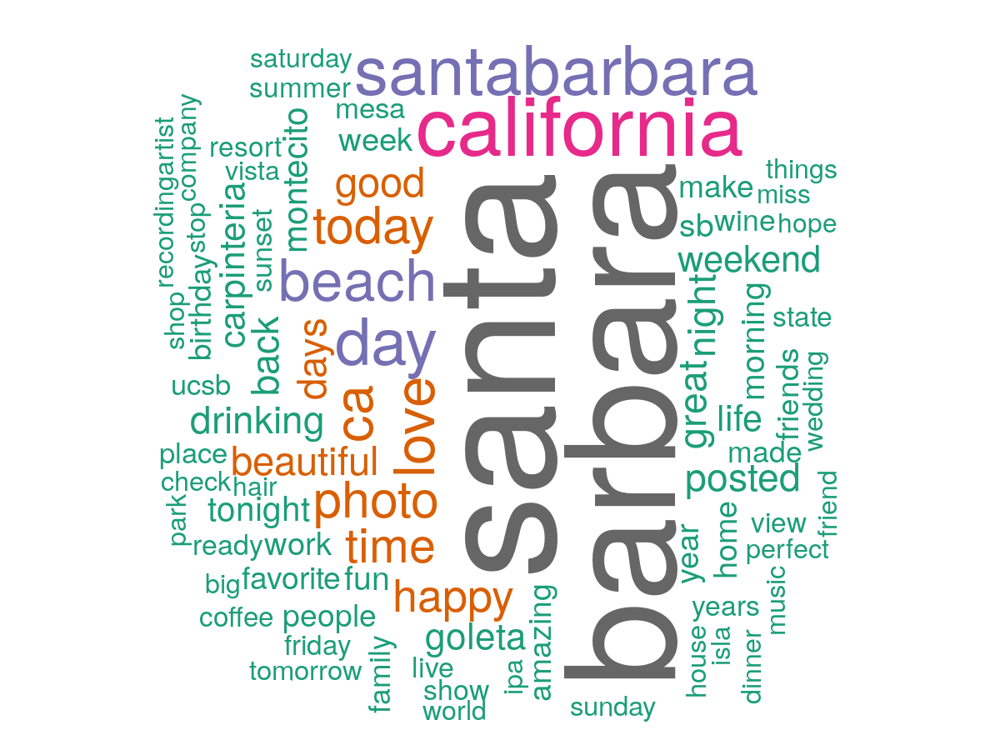

```{r setup, include=FALSE, message = FALSE, warning = FALSE}
knitr::opts_chunk$set(echo = FALSE, message = FALSE, warning = FALSE)

library(mapview)
library(tidyverse)
library(sf)
library(leaflet)
library(kableExtra)
library(sp)
library(ggpol) #for the facet_share function
library(grid) #for plot.margin

tweet_data <- read_csv("data/geotagged_sb_tweets.csv")
mapviewOptions(basemaps = c("CartoDB.Positron", "OpenStreetMap"))
```

# Project Summary

Project summary

Goals
- 
- 
- 

Findings


# Analysis & findings

### Data Overview

**Twitter data**

Twitter data was obtained freely through a partnership between UCSB Library and Crimson Hexagon. Before downloading, the data was queried to meet the following conditions:

1. Tweet came from the Santa Barbara area (add more details about how CH applies the location query)
2. Only original tweets (no retweets)
3. Date was marked between January 1, 2015 and December 31, 2019

Crimson Hexagon only allows 10,000 randomly selected tweets to be exported, manually, at a time in .xls format. Due to this restriction, data was manually downloaded for every 2 days in order to capture all tweets. There were around 5000 average number of daily tweets that met these conditions.

The Crimson Hexagon data did not contain all desired information, including whether or not the tweet was geotagged. To get this information we used the python `twarc` library to "rehydrate" the data using individual tweet ids and store the tweet information as .json files. From here we were able to remove all tweets that did not have a geotag, giving us a total of **79,981** tweets.

#### Table of data

Here is a sample of the type of the final twitter information we obtained.

```{r, echo = FALSE}
kable(sample_n(tweet_data %>% select(-tweet_id, -user_id, -geo_type, -geo_coordinates, -language, -lat, -lon), 7)) %>%
  kable_styling(bootstrap_options = c("striped", "condensed"), font_size = 11, fixed_thead = T)
```

The spatial distribution of tweets highlights areas of higher population density and tourist areas in downtown Santa Barbara. There is a single coordinate that has over 11,000 tweets reported across all years. It is near De La Vina between Islay and Valerio. There is nothing remarkable about this site so I assume it is the default coordinate when people tag "Santa Barbara" generally. The coordinate is 34.4258, -119.714.

#### Interactive map with cluster markers

As you zoom in on the map, clusters will disaggregate. You can click on blue points to see the tweet.

```{r, echo = FALSE}
tweet_sf <- tweet_data %>%
  st_as_sf(coords = c("lon", "lat")) %>%
  st_set_crs(4326)

#map
leaflet(tweet_data) %>%
  # Base groups
  addProviderTiles(providers$CartoDB.Positron) %>%
  # Overlay groups %>%
    addCircleMarkers(data = tweet_data, lng = ~lon, lat = ~lat, popup = ~full_text,
                   radius = 3, stroke = FALSE, fillOpacity = 0.5, clusterOptions = markerClusterOptions())
```

#### Tweet density

This is log-transformed. 

```{r, echo = FALSE}
hex_grid <- read_sf("data/sb_area_hexagons.shp")

hex_tweet_count <- hex_grid %>%
  mutate(tweet_count = lengths(st_intersects(hex_grid, tweet_sf)),
         log_tweet_count = log(tweet_count))

log_hex_map <-mapview(hex_tweet_count %>% filter(tweet_count > 0), #remove hexes with no tweets
                 zcol = "log_tweet_count", layer.name = "Tweet count (log)")

log_hex_map@map %>% setView(lng = -119.714, lat = 34.426, zoom = 13)
```

## Tourists and locals

This project aims to understand if and how preferences differ between tourists and locals for nature-based places within the Santa Barbara area. In order to test this we needed to come up with a way to identify tourists or locals. We used a two step process.

First, if the user has self-identified their location as somewhere in the Santa Barbara area, they are designated a *local*. This includes Carpinteria, Santa Barbara, Montecito, Goleta, Gaviota and UCSB. For the remainder, we use the number of times they have tweeted from Santa Barbara within a year to designate user type. If someone has tweeted across more than 2 months in the same year from Santa Barbara, they are identified as a local. This is consistent with how [Eric Fischer](https://www.citylab.com/transportation/2015/02/where-do-locals-go-in-major-cities-check-out-this-interactive-world-map/385768/) determined tourists in his work. This is not fool-proof and there are instances were people visit and tweet from Santa Barbara more than two months a year, especially if they are visiting family or live within a couple hours driving distance.

```{r, echo = FALSE}
tweet_data_users <- read_csv("data/geotag_sb_tweets_user_type.csv")

tweet_data_users_sf <- tweet_data_users %>%
  st_as_sf(coords = c("lon", "lat")) %>%
  st_set_crs(4326)
```

There are `r nrow(filter(tweet_data_users, user_type == "tourist"))` tweets from tourists and `r nrow(filter(tweet_data_users, user_type == "local"))` tweets from locals.

The following map shows tweet **log density** by locals (top - blue) and tourists (bottom - red).

```{r, echo = FALSE}

hex_grid <- read_sf("data/sb_area_hexagons.shp")
locals   <- tweet_data_users_sf %>% filter(user_type == "local")
tourists <- tweet_data_users_sf %>% filter(user_type == "tourist")

hex_tweet_count_locals <- hex_grid %>%
  mutate(tweet_count = lengths(st_intersects(hex_grid, locals)),
         log_tweet_count = log(tweet_count))

hex_tweet_count_tourists <- hex_grid %>%
  mutate(tweet_count = lengths(st_intersects(hex_grid, tourists)),
         log_tweet_count = log(tweet_count))

#color palettes
blues = colorRampPalette(c("#DEEBF7", "#08306B"))
reds = colorRampPalette(c("#FEE0D2", "#67000D"))

m1 <- mapview(hex_tweet_count_locals %>% filter(tweet_count > 0), 
        zcol = "log_tweet_count", 
        layer.name = "# tweets by locals (log)",
        col.regions = blues,
        alpha.regions = 0.9,
        legend = FALSE)
m2 <- mapview(hex_tweet_count_tourists %>% filter(tweet_count > 0), 
          zcol = "log_tweet_count", 
          layer.name = "# tweets by tourists (log)",
        col.regions = reds,
        alpha.regions = 0.9, 
        legend = FALSE) 

m3 <- m1@map %>% setView(lng = -119.714, lat = 34.426, zoom = 13)
m4 <- m2@map %>% setView(lng = -119.714, lat = 34.426, zoom = 13)
sync(m3, m4, ncol = 1)
```

## Nature-based tweets

The full text of each tweet was analyzed to be either nature-based or not. We developed a coarse dictionary of words that indicate a nature-based tweet. These include natural features like ocean, coast, park, and works that indicate recreating (fishing, hiking, camping, etc.).

**Note**
I had a hard time finding an ontology or lexicon that would fit this project. These are definitely skewed more towards nature and recreation rather than words like "home" or "connection".

```{r, echo = FALSE}
dictionary <- read_csv("data/dictionary.csv")
nature_df <- read_csv("data/tweets_nature_categorized.csv")
dictionary$word
```

Let's look at some examples of what tweets qualified as "nature-based".

```{r}
kable(sample_n(nature_df %>% filter(nature_word == 1) %>% select(date, full_text, user_location, user_type, nature_word), 7)) %>%
  kable_styling(bootstrap_options = c("striped", "condensed"), font_size = 11, fixed_thead = T)
```

### Where are nature-based tweets?

After identifying nature-based tweets we can take a look at where these tweets are coming from and compare to the general pattern of tweets. 

```{r}
nature_sf <- nature_df %>%
  st_as_sf(coords = c("lon", "lat")) %>%
  st_set_crs(4326)

hex_tweet_count_nature <- hex_grid %>%
  mutate(tweet_count = lengths(st_intersects(hex_grid, nature_sf %>% filter(nature_word == 1))),
         log_tweet_count = log(tweet_count))

#color palettes
greens = colorRampPalette(c("#E5F5E0", "#00441B"))

m <- mapview(hex_tweet_count_nature %>% filter(tweet_count > 0), 
        zcol = "log_tweet_count", 
        layer.name = "# Nature tweets (log)")
        #col.regions = greens) 

m@map %>% setView(lng = -119.714, lat = 34.426, zoom = 13)
```


### Who is tweeting nature-based tweets?

```{r, echo = FALSE}
nature_df_user_type <- nature_df %>%
    mutate(coords = gsub("\\)|c\\(", "", geo_coordinates)) %>%
    separate(coords, c("lat", "lon"), sep = ", ") %>%
    mutate_at(c("lon", "lat"), as.numeric) %>% 
    st_as_sf(coords = c("lon", "lat")) %>%
    st_set_crs("+init=epsg:4326") %>%
  mutate(tweet_type = ifelse(nature_word == 1, "nature tweet", "non-nature tweet"),
         nature_user = case_when(
            user_type == "local" & nature_word == 0 ~ "local, non nature tweet",
            user_type == "tourist" & nature_word == 0 ~ "tourist, non nature tweet",
            user_type == "tourist" & nature_word == 1 ~ "tourist, nature tweet",
            user_type == "local" & nature_word == 1 ~ "local, nature tweet"
        ))
```

Not surprisingly there are less nature-based tweets than nature-based. Of all `r nrow(data)` tweets, `r nrow(nature_df %>% filter(nature_word == 1))/nrow(data)*100`% are nature-based.

Of local tweeters, `r nrow(nature_df %>% filter(nature_word == 1, user_type == "local"))/nrow(nature_df %>% filter(user_type == "local"))*100`% of tweets are nature-based. Of tourists, `r nrow(nature_df %>% filter(nature_word == 1, user_type == "tourist"))/nrow(nature_df %>% filter(user_type == "tourist"))*100`% are nature-based.

```{r, echo = FALSE}
ggplot(nature_df_user_type, aes(x = tweet_type, fill = tweet_type)) +
  geom_bar() +
  theme_minimal() +
  labs(y = "# Tweets",
       x = "Type of tweet") +
  theme(legend.position = "none") +
  facet_wrap(~user_type) +
  scale_x_discrete(labels=c("Nature", "Non-nature")) +
  scale_fill_manual(values = c("darkgreen", "darkgray"))
```


### Are tweets in protected areas more often nature-based?

**California Protected Areas Database**

We can use the CPAD data to identify protected areas. [expandon CPAD here]

```{r, echo = FALSE}
cpad <- read_sf("data/cpad_fixed.shp")

cpad_map <- mapview(cpad, zcol = "SITE_NAME", legend = FALSE)
cpad_map@map %>% setView(lng = -119.714, lat = 34.426, zoom = 13)
```


**How many tweets come from these areas?**

Count how many points in each polygon (all types of tweets not just nature based)

```{r, echo = FALSE}
nature_sf <- nature_df %>%
    mutate(coords = gsub("\\)|c\\(", "", geo_coordinates)) %>%
    separate(coords, c("lat", "lon"), sep = ", ") %>%
    mutate_at(c("lon", "lat"), as.numeric) %>% 
    st_as_sf(coords = c("lon", "lat")) %>%
    st_set_crs("+init=epsg:4326") %>%
  mutate(tweet_type = ifelse(nature_word == 1, "nature tweet", "non-nature tweet"),
         nature_user = case_when(
            user_type == "local" & nature_word == 0 ~ "local, non nature tweet",
            user_type == "tourist" & nature_word == 0 ~ "tourist, non nature tweet",
            user_type == "tourist" & nature_word == 1 ~ "tourist, nature tweet",
            user_type == "local" & nature_word == 1 ~ "local, nature tweet"
        ))
```

Some of these areas overlap with high tourist areas (e.g. the Bowl, Zoo and Wharf). Let's look at the content of these tweets to see how often tweets coming from these locations are nature-based or not.

**Compare occurrence of nature vs non-nature based tweets**

```{r, echo = FALSE}
nature_tweets <- nature_sf %>%
  filter(nature_word == 1)
non_nature_tweets <- nature_sf %>% 
  filter(nature_word == 0)

cpad_all_count <- cpad %>%
  mutate(total_tweets = lengths(st_intersects(cpad, nature_sf)),
         nature_count = lengths(st_intersects(cpad, nature_tweets)),
         non_nature_count = lengths(st_intersects(cpad, non_nature_tweets))) %>%
  rowwise() %>%
  mutate(ratio = nature_count/non_nature_count,
         prop  = nature_count/total_tweets) %>%
  filter(!is.na(ratio)) %>%
  mutate(ratio = ifelse(is.infinite(ratio), nature_count, ratio)) %>% 
  st_set_geometry("geometry")
```

The highest ratio of nature tweets to non-nature takes place at `r filter(cpad_all_count, ratio == max(cpad_all_count$ratio))$SITE_NAME`.

```{r}
mapview(cpad_all_count %>% select(prop, ratio, total_tweets), burst = TRUE, hide = TRUE)@map %>% setView(lng = -119.714, lat = 34.426, zoom = 13)
```

Let's look at the top 20 most popular sites

```{r}
top_20 <- cpad_all_count %>%
  st_set_geometry(NULL) %>%
  arrange(-nature_count) %>%
  slice(1:20) %>%
  pivot_longer(cols = c(nature_count, non_nature_count), names_to = "tweet_type", values_to = "count")

top_20_prop <- top_20 %>% 
  select(SITE_NAME, prop, count) %>%
  group_by(SITE_NAME, prop) %>%
  summarise(count = sum(count)) %>%
  ungroup() %>%
  distinct() %>%
  mutate(prop = paste0(round(100*prop,0),"% "))

ggplot(top_20, aes(x = reorder(SITE_NAME, count), fill = tweet_type, y = count)) +
  geom_bar(stat = "identity", position = "stack") +
  theme_minimal() +
  coord_flip() +
  labs(x = "",
       y = "Number of tweets",
       fill = "",
       title = "Top 20 most tweeted from protected areas* in Santa Barbara") +
  scale_fill_manual(values = c("darkgreen", "gray"), labels = c("Nature-based", "Other")) +
  theme(legend.position = "none",
        plot.title = element_text(hjust = 1.5)) +
    geom_text(aes(SITE_NAME, y = count, label = prop, fill = NULL), 
              data = top_20_prop, hjust = -0.05, size = 3) +
  ylim(0, 1510)
```

Not surprisingly the Santa Barbara Bowl has the most number of tweets, but only half are nature based (the view is great!). If we just look at proportion of nature-based tweets we see a different ordering. I removed any places with just 1 tweet since it will skew results if that tweet happens to be nature-based (a total of 4 places).

```{r, echo = FALSE}
top_20 <- cpad_all_count %>%
  group_by(SITE_NAME, MNG_AGNCY) %>%
  mutate(total_tweets = sum(nature_count, non_nature_count)) %>%
  ungroup() %>%
  filter(total_tweets > 1) %>%
  st_set_geometry(NULL) %>%
  arrange(-prop) %>%
  slice(1:20) 

ggplot(top_20, aes(x = reorder(SITE_NAME, prop), y = prop)) +
  geom_bar(stat = "identity", fill = "darkgreen") +
  theme_minimal() +
  coord_flip() +
  labs(x = "",
       y = "Proportion of tweets that are nature-based",
       title = "Top 20 sites with highest proportion of nature-based tweets") +
  theme(plot.title = element_text(hjust = 4)) 
```


**How does this differ across tourists and locals?**

```{r}
cpad_locals <- cpad %>%
  mutate(nature_count = lengths(st_intersects(cpad, nature_tweets %>% filter(user_type == "local"))),
         non_nature_count = lengths(st_intersects(cpad, non_nature_tweets %>% filter(user_type == "local")))) %>%
  rowwise() %>%
  mutate(ratio = nature_count/non_nature_count,
         prop  = nature_count/sum(c(nature_count, non_nature_count))) %>%
  filter(!is.na(ratio)) %>%
  mutate(ratio = ifelse(is.infinite(ratio), nature_count, ratio),
         user_type = "local") %>% 
  st_set_geometry("geometry")

cpad_tourists <- cpad %>%
  mutate(nature_count = lengths(st_intersects(cpad, nature_tweets %>% filter(user_type == "tourist"))),
         non_nature_count = lengths(st_intersects(cpad, non_nature_tweets %>% filter(user_type == "tourist")))) %>%
  rowwise() %>%
  mutate(ratio = nature_count/non_nature_count,
         prop  = nature_count/sum(c(nature_count, non_nature_count))) %>%
  filter(!is.na(ratio)) %>%
  mutate(ratio = ifelse(is.infinite(ratio), nature_count, ratio),
         user_type = "tourist") %>% 
  st_set_geometry("geometry")

cpad_users <- cpad_locals %>%
  rbind(cpad_tourists)
```


Looking at the breakdown between tourists and locals. The sites included here have at least 50 tweets total across the time frame.

```{r, message = FALSE, warning= FALSE}
pyramid_df <- cpad_users %>%
  st_set_geometry(NULL) %>%
  #mutate(prop_non_nature = 1-prop) %>%
  pivot_longer(cols = c(nature_count, non_nature_count), names_to = "tweet_type", values_to = "count") %>%
  group_by(SITE_NAME) %>%
  mutate(total = sum(count)) %>%
  ungroup() %>%
  filter(total > 24) %>%
  mutate(count = ifelse(user_type == "local", -1*count, count),
         prop = ifelse(tweet_type == "non_nature_count", NA, prop))

labs <- c(local = "Locals", tourist = "Tourists")

ggplot(pyramid_df, aes(x = reorder(SITE_NAME, total), fill = tweet_type, y = count)) +
  geom_bar(stat = "identity", position = "stack") +
  #geom_text(aes(label = round(prop*100,0), y = count), size = 3) +
  facet_share(~user_type, dir = "h", scales = "free", reverse_num = TRUE, 
              labeller = labeller(user_type = labs)) +
  coord_flip() +
  theme_minimal() +
  scale_fill_manual(values = c("darkgreen", "gray"), labels = c("Nature-based", "Other")) +
  theme(legend.position = "none",
        plot.margin=grid::unit(c(0,10,0,-60), "mm")) +
  labs(x=NULL,y=NULL)
```


----
## Time

### Timeline of tweets

Initial hypothesis was identifying spikes in nature-based tweets around three significant events:
- Refugio oil spill in 2015
- Thomas fire in 2017
- Debris flow in 2018

## Word clouds
top 100 words for locals vs tourist. And we could do this in space. At sterns wharf what are people tweeting about? At Elings, what are locals tweeting about?



Maybe in word clouds we can see some changes due to natural events

### All of SB

### By area

## Sentiment Analysis


# Lessons learned

## Data is harder to find

# Future research

## Looking at different scale areas

There might be an interesting comparison between rural-suburban-urban areas. We hypothseize that the tourist/local alignment would split in urban areas, maybe aligned in suburban (like SB) and maybe not exist in rural.

Proportion of words that are nature based tells you how people. In Santa Barbara, there will be a lot of nature-based sense of place. In Manhattan, we wouldn’t expect to see nature based ones so much.

In a blog piece we can pose questions that we couldn’t answer but stuff like “can proportion of tourists/locals in place engagement tell us anything”.

Could compare % nature based tweets in SB to other areas. If we did this across the whole state, what proportion% are nature based? Maybe on average its just 5%.


Where and why do locals and tourists overlap in their use of area. SB seems to have a high alignment of tourists/locals, which may be helpful for local policy. Maybe places with distinct differences in how tourists/locals use places. 

Look at cities of different coastal sizes rural - small town - urban - mega city. Could see how tourists/locals patterns differentiate across scale. 

Is there a threshold of tourists where locals don’t go anymore? 

In areas where we see both tourists and locals engaging, what characteristics do we see? 

Quantifying transitions between rural to city. 

# Talk about overall social media literature for conservation and how this project is similar/different and used lessons from those papers to guide this analysis.
