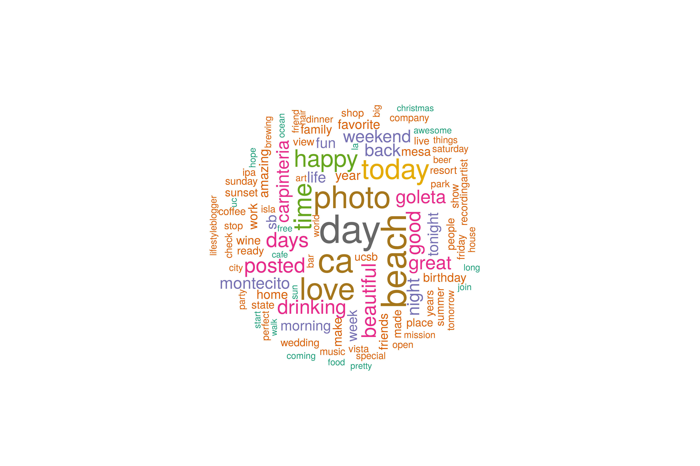

```{r setup, include=FALSE, message = FALSE, warning = FALSE}
knitr::opts_chunk$set(echo = FALSE, message = FALSE, warning = FALSE)

library(mapview)
library(tidyverse)
library(sf)
library(leaflet)
library(kableExtra)
library(sp)
library(ggpol) #for the facet_share function
#library(grid) #for plot.margin
library(RColorBrewer)
library(ggrepel)
library(patchwork)
library(ggmap)
library(ggtext)

tweet_data <- read_csv("data/geotagged_sb_tweets_post_apr_2015.csv")
mapviewOptions(basemaps = c("CartoDB.Positron", "OpenStreetMap"))
```

# Project Summary

The aim of this project was to evaluate whether or not geotagged social media data can be useful in providing insight into a region's "Sense of Place" using Santa Barbara as a case study. Sense of Place can be defined as the connection people feel to their geographic surroundings, including both the natural and built environment. Locations with a strong sense of place often have a strong identity felt by both locals and visitors. 

Geotagged social media data has been used in recent years to study people's interaction with the natural environment in various ways, many of which are focused on tourism:
- Quantifying nature-based tourism (Wood et al. 2013, Kim et al. 2019, )
- Mapping tourist footprints (Runge & Daigle 2020), flows (Chua et al. 2016), and hot spots (Garcia-Palomares et al. 2015)
- Understand tourist preferences in nature based places such as Kruger National Park (Hausmann et al. 2017, Levin et al. 2017, Tenkanen  et al. 2017)
- Monitor and measure environmental conditions of places (e.g. Great Barrier Reef, Becken et al. 2017)

This project differs in that we wanted to map the spatial patterns of tourists and locals, and understand how these two user groups engage with and perceive the natural environment of Santa Barbara.

## Findings

- While the number of geotagged tweets has been decreasing overtime, the proportion of nature-based tweets has increased over time  
- Locals and tourists have similar spatial patterns with a higher proportion of tourists visiting more accessible, well-known areas, and a higher proportion of locals at locations further from the downtown Santa Barbara area.  
- Sentiment analysis reveal increasing positive sentiment over time for both nature based and non-nature based tweets.  

## Takeaways

- There are opportunities to expand on these findings if compared to other locations of various sizes, but we are not pursuing a larger project at this time   
- Social media data is very difficult to access for academic research and recent restrictions limit the potential to scale this analysis up   
- Project findings will be published in a blog post and shared broadly via social media  

## Methods summary

- Roughly **65,000** geotagged tweets were queried from April 30, 2015 to December 31, 2019.   
- Tourists and locals were identified using a two-step process based first on their stated location and then using the number of months a user tweeted from Santa Barbara within a year  
- Spatial patterns of tourists and locals were mapped  
- Nature-based tweets were identified using text detection by comparing tweet content to a compiled dictionary of nature-based words  
- The California Protected Areas Database (CPAD) was used to identify areas of importance for their natural environment, and overlaid with twitter data to reveal patterns about who visits these areas and content of tweets from these locations  
- Sentiment and text analysis were applied to tweet text to calculate positive/negative sentiment over time and identify important words for nature-based tweets  

-----

# Data summary

Twitter data was obtained freely through a partnership between UCSB Library and Crimson Hexagon. Before downloading, the data was queried to meet the following conditions:

1. Tweet came from the Santa Barbara area
2. Only original tweets (no retweets)
3. Date was marked between January 1, 2015 and December 31, 2019

**Acessing Data**

Crimson Hexagon only allows 10,000 randomly selected tweets to be exported, manually, at a time in .xls format. Due to this restriction, data was manually downloaded for every 2 days in order to capture all tweets. There were around 5000 average number of daily tweets that met these conditions.

The Crimson Hexagon data did not contain all desired information, including whether or not the tweet was geotagged. To get this information we used the python `twarc` library to "rehydrate" the data using individual tweet ids and store the tweet information as .json files. From here we were able to remove all tweets that did not have a geotag, giving us a total of **79,981** tweets (including Jan-Apr 2015).

#### Sample of twitter data

```{r, echo = FALSE}
kable(sample_n(tweet_data %>% select(-user_id,  -geo_coordinates, -lat, -lon), 7)) %>%
  kable_styling(bootstrap_options = c("striped", "condensed"), font_size = 11, fixed_thead = T)
```


#### Tweets over time

The number of geotagged tweets is going down over time. There is a significant drop in tweets at the end of April, 2015. It seems this is due "a change in Twitter’s ‘post Tweet’ user-interface design results in fewer Tweets being geo-tagged" ( [source](https://developer.twitter.com/en/docs/tweets/data-dictionary/guides/tweet-timeline)). The first 4 months of 2015 have 15,720 tweets, or roughly 19% of all tweets. To reduce a skew in the data and remove geotagged tweets that may have been geotagged without knowledge by the user in those months, *we moved forward with all tweets from May 1, 2015 through the end of 2019*.

```{r}
time_df <- read_csv("data/geotagged_sb_tweets.csv") %>%
  group_by(date) %>%
  summarize(count = n())

ggplot(time_df, aes(x = date, y = count)) +
  annotate("rect", fill = "gray80", alpha = 0.4, 
        xmin = as.Date("2015-04-30"), xmax = as.Date("2020-01-01"),
        ymin = -Inf, ymax = 170)  +
  geom_line() +
  geom_smooth() +
  theme_minimal() +
  geom_label(
    data = data.frame(x = c(as.Date("2015-06-15")),
                      y = c(215),
                      label = c("User interface change, results in \nfewer Tweets being geo-tagged")),
    aes(x = x, y = y, label = label), 
    hjust = 0, 
    lineheight = .8, 
    size = 3,
    inherit.aes = FALSE, 
    label.size = 0
  ) +
  geom_curve(
    data = data.frame(x = c(as.Date("2015-06-15")),
                      y = c(214), 
                      xend = c(as.Date("2015-04-30")),
                      yend = c(207)),
    mapping = aes(x = x, y = y, xend = xend, yend = yend),
    colour = "black",
    size = 0.5,
    curvature = 0.05,
    arrow = arrow(length = unit(0.01, "npc"), type = "closed"),
    inherit.aes = FALSE) +
  labs(x = "",
       y = "Count",
       title = "Number of geotagged tweets in Santa Barbara") +
  geom_label(x = as.Date("2019-01-01"), y = 150, 
            label = "Final dataset included tweets \nfrom April 30, 2015 onwards",
            size = 3,   
    label.size = 0)
```


Given that the tweet dataset is queried to just those that are geotagged - I hypothesize that most of these tweets have a picture or a link to an instagram post. We can detect links by looking for "t.co" in the tweet which is a twitter URL for a separate webpage. These are often twitter or instagram photos but we can't be 100% certain.

```{r num_tweets_w_pic}
tweet_picture_counts <- tweet_data %>%
  filter(!str_detect(full_text, '^"')) %>%
  count(picture = ifelse(str_detect(full_text, "t.co"),
                         "Picture/link", "No picture/link")) %>%
  mutate(prop = round(n/sum(n)*100, 0))
```

It looks like **`r tweet_picture_counts[2,3]$prop`%** of geotagged tweets contain a link or picture.

```{r, fig.height = 3}
ggplot(tweet_picture_counts, aes(x = picture, y = n, fill = picture)) +
  geom_col() +
  theme_minimal() +
  theme(legend.position = "none") +
  labs(x = "", y = "Number of tweets")
```


## Tweet maps

The spatial distribution of tweets highlights areas of higher population density and tourist areas in downtown Santa Barbara.

There is a single coordinate that has over 11,000 tweets reported across all years. It is near De La Vina between Islay and Valerio. There is nothing remarkable about this site so I assume it is the default coordinate when people tag "Santa Barbara" generally. The coordinate is 34.4258, -119.714.

As you zoom in on the map, clusters will disaggregate. You can click on blue points to see the tweet.

```{r, echo = FALSE, fig.width = 8}
tweet_sf <- tweet_data %>%
  st_as_sf(coords = c("lon", "lat"), remove = F) %>%
  st_set_crs(4326)

#map
leaflet(tweet_data) %>%
  # Base groups
  addProviderTiles(providers$CartoDB.Positron) %>%
  # Overlay groups %>%
    addCircleMarkers(data = tweet_data, lng = ~lon, lat = ~lat, popup = ~full_text,
                   radius = 3, stroke = FALSE, fillOpacity = 0.5, clusterOptions = markerClusterOptions())
```

#### Tweet density

Each hexagon shows the log10 density of tweets in that area. The highest number of tweets in a single location is around 11,000 (yellow hex). This includes the default Santa Barbara coordinate used for geotagging from the city of Santa Barbara without a precise location

```{r, echo = FALSE, fig.width = 8}
hex_grid <- read_sf("data/sb_area_hexagons.shp")

hex_tweet_count <- hex_grid %>%
  mutate(tweet_count = lengths(st_intersects(hex_grid, tweet_sf)),
         log_tweet_count = log10(tweet_count))

log_hex_map <-mapview(hex_tweet_count %>% filter(tweet_count > 0), #remove hexes with no tweets
                 zcol = "log_tweet_count", layer.name = "Count (log10)", 
                 col.regions = colorRampPalette(brewer.pal(9, "BuPu")[2:9]), legend.opacity = 0.5)

log_hex_map@map %>% setView(lng = -119.714, lat = 34.426, zoom = 13)
```

----

# Analysis & Results

## Tourists and locals

This project aims to understand if and how preferences differ between tourists and locals for nature-based places within the Santa Barbara area. In order to test this we needed to come up with a way to identify tourists or locals. We used a two step process.

First, if the user has self-identified their location as somewhere in the Santa Barbara area, they are designated a *local*. This includes Carpinteria, Santa Barbara, Montecito, Goleta, Gaviota and UCSB. For the remainder, we use the number of times they have tweeted from Santa Barbara within a year to designate user type. If someone has tweeted across more than 2 months in the same year from Santa Barbara, they are identified as a local. This is consistent with how [Eric Fischer](https://www.citylab.com/transportation/2015/02/where-do-locals-go-in-major-cities-check-out-this-interactive-world-map/385768/) determined tourists in his work. This is not fool-proof and there are instances were people visit and tweet from Santa Barbara more than two months a year, especially if they are visiting family or live within a couple hours driving distance.

```{r, echo = FALSE}
tweet_data_users <- read_csv("data/geotag_sb_tweets_user_type.csv")

tweet_data_users_sf <- tweet_data_users %>%
  st_as_sf(coords = c("lon", "lat"), remove = F) %>%
  st_set_crs(4326)
```

There are `r nrow(filter(tweet_data_users, user_type == "tourist"))` tweets from tourists and `r nrow(filter(tweet_data_users, user_type == "local"))` tweets from locals (`r round(nrow(filter(tweet_data_users, user_type == "tourist"))/nrow(tweet_data_users)*100,0)`% and `r round(nrow(filter(tweet_data_users, user_type == "local"))/nrow(tweet_data_users)*100,0)`%). There are `r nrow(tweet_data_users%>%filter(user_type == "tourist") %>% select(user_type, user_id) %>% distinct())` unique tourists and just `r nrow(tweet_data_users%>%filter(user_type == "local") %>% select(user_type, user_id) %>% distinct())` unique local users.

```{r, fig.width = 6, fig.height = 6}
#santa barbara
sb.map <- get_map("santa barbara, california", zoom = 14, maptype = "toner-lite") 

ggmap(sb.map,  legend="none") +
  coord_equal() +
    labs(x = NULL, y = NULL) +
    theme(axis.text = element_blank()) +
    geom_point(data = tweet_data_users_sf, aes(x = lon, y = lat, color = user_type),
               size = 0.55, alpha = 0.3) + 
    scale_color_manual(values = c("red", "blue")) +
  labs(fill = "User type",
       title = "Santa Barbara tweets from <b style='color:#FF0000'>locals</b> and <b style='color:#0000FF'>tourists</b>") +
  theme(plot.title = element_markdown(lineheight = 1.1),
        legend.position = "none")
```

### Spatial preferences by user type

The following map shows areas that have more tweets from locals (orange) or tourists (purple). Note the values indicate the log10 of the absolute difference between number of tweets from each user group. If a hex is purple and has a value of 2, this means there are 100 times more tweets from tourists than locals at that location.

```{r, echo = FALSE, fig.width = 8}

hex_grid <- read_sf("data/sb_area_hexagons.shp")
locals   <- tweet_data_users_sf %>% filter(user_type == "local")
tourists <- tweet_data_users_sf %>% filter(user_type == "tourist")

hex_tweet_count <- hex_grid %>%
  mutate(local_tweet_count = lengths(st_intersects(hex_grid, locals)),
         local_log_tweet_count = log(local_tweet_count),
         tourist_tweet_count = lengths(st_intersects(hex_grid, tourists))) %>%
  mutate(
         tourist_log_tweet_count = log(tourist_tweet_count),
         total = local_tweet_count + tourist_tweet_count,
         diff = local_tweet_count - tourist_tweet_count)


#where tourists go more
t <- hex_tweet_count %>% 
  filter(diff < 0) %>%
  mutate(value = -1*diff,
         log_value = log10(value))

l <- hex_tweet_count %>%
  filter(diff > 0) %>%
  mutate(log_value = log10(diff))

#map
tl_map <- mapview(t, zcol = "log_value", layer.name = "Tourist preferred # tweets", 
        col.regions = colorRampPalette(brewer.pal(9, "Purples")[4:9]), alpha.regions = 1) +
  mapview(l, zcol = "log_value", layer.name = "Local preferred # tweets", 
        col.regions = colorRampPalette(brewer.pal(9, "Oranges")[4:9]), alpha.regions = 1)

tl_map@map %>% setView(lng = -119.714, lat = 34.426, zoom = 13)
```

## Nature-based tweets

The full text of each tweet was analyzed to be either nature-based or not. We developed a coarse dictionary of words that indicate a nature-based tweet. These include natural features like ocean, coast, park, and works that indicate recreating (fishing, hiking, camping, etc.).

**Note:** I had a hard time finding an ontology or lexicon that would fit this project. These are definitely skewed more towards nature and recreation rather than words like "home" or "connection".

```{r, echo = FALSE}
dictionary <- read_csv("data/dictionary.csv")
nature_df <- read_csv("data/tweets_nature_categorized.csv")
dictionary$word
```

Let's look at some examples of what tweets qualified as "nature-based".

```{r}
kable(sample_n(nature_df %>% filter(nature_word == 1) %>% select(date, full_text, user_location, user_type, nature_word), 7)) %>%
  kable_styling(bootstrap_options = c("striped", "condensed"), font_size = 11, fixed_thead = T)
```

### Proportion of tweets considered "nature-based" over time

All groups show increases in proportion of tweets that are nature based over time.

```{r, fig.height = 3, fig.width = 8}
nature_prop <- nature_df %>% 
               group_by(date, nature_word) %>%
               summarize(count = n()) %>%
               ungroup() %>%
               group_by(date) %>%
               mutate(total = sum(count),
                      nature_prop = (count/total)*100) %>%
               filter(nature_word == 1) %>%
               mutate(user_type = "all_tweets")

nature_prop_t <- nature_df %>%
               group_by(date, nature_word, user_type) %>%
               summarize(count = n()) %>%
               ungroup() %>%
               group_by(date, user_type) %>%
               mutate(total = sum(count),
                      nature_prop = (count/total)*100) %>%
               filter(nature_word == 1)

combo <- bind_rows(nature_prop, nature_prop_t)


labels <- data.frame(user_type = c("All tweets", "Tourists", "Locals"), 
                     nature_prop = c(31.5, 43, 29)) %>%
                     mutate(date = as.Date("2020-03-29"))


ggplot(combo, aes(x = date, y = nature_prop, color = user_type)) +
  geom_smooth(se = F) +
  theme_minimal() +
  labs(x = "",
       y = "Percentage (%)") +
  theme(legend.position = "none") +
  geom_text(data = labels, aes(x = date, y = nature_prop, label = user_type)) +
  scale_x_date(expand = expand_scale(mult = c(0, 0.1))) +
  scale_colour_manual(values = c("darkgreen","darkgreen", "purple","purple", "orange", "orange"),
                      labels = c("All tweets", "Tourists", "Locals"))
```

### Where are nature-based tweets?

After identifying nature-based tweets we can take a look at where these tweets are coming from and compare to the general pattern of tweets. 

```{r}
nature_sf <- nature_df %>%
  st_as_sf(coords = c("lon", "lat"), remove = F) %>%
  st_set_crs(4326)
```

```{r, fig.width = 6, fig.height = 6}
#santa barbara
sb.map <- get_map("santa barbara, california", zoom = 14, maptype = "toner-lite") 

ggmap(sb.map,  legend="none") +
  coord_equal() +
    labs(x = NULL, y = NULL) +
    theme(axis.text = element_blank()) +
    geom_point(data = nature_sf %>% filter(nature_word == 1), aes(x = lon, y = lat),
               size = 0.55, alpha = 0.3, color = "darkgreen") + 
  labs(fill = "User type",
       title = "<b style='color:#006400'>Nature-based</b> tweets in Santa Barbara") +
  theme(plot.title = element_markdown(lineheight = 1.1),
        legend.position = "none")
```

##### Percentage of tweets that are nature-based across Santa Barbara

```{r, fig.width = 8 }
#overlap the hex grids with tweets
hex_tweet_counts_nature <- hex_grid %>%
  mutate(nature_twts = lengths(st_intersects(hex_grid, nature_sf %>% filter(nature_word == 1))),
         non_nature_twts = lengths(st_intersects(hex_grid, nature_sf %>% filter(nature_word == 0))),
         total = lengths(st_intersects(hex_grid, nature_sf))) %>%
  rowwise() %>%
  mutate(prop = round(nature_twts/total*100),2) %>%
  filter(total > 0) %>% 
  st_set_geometry("geometry")


m <- mapview(hex_tweet_counts_nature, zcol = "prop", 
             col.regions = colorRampPalette(brewer.pal(9, "BuGn")[2:9]), legend.opacity = 0.5, alpha = 0.9,
             layer.name = "Percentage (%)")

m@map %>% setView(lng = -119.714, lat = 34.426, zoom = 13)
```


### Who is tweeting nature-based tweets?

```{r, echo = FALSE}
nature_df_user_type <- nature_df %>%
    mutate(coords = gsub("\\)|c\\(", "", geo_coordinates)) %>%
    separate(coords, c("lat", "lon"), sep = ", ") %>%
    mutate_at(c("lon", "lat"), as.numeric) %>% 
    st_as_sf(coords = c("lon", "lat")) %>%
    st_set_crs("+init=epsg:4326") %>%
  mutate(tweet_type = ifelse(nature_word == 1, "nature tweet", "non-nature tweet"),
         nature_user = case_when(
            user_type == "local" & nature_word == 0 ~ "local, non nature tweet",
            user_type == "tourist" & nature_word == 0 ~ "tourist, non nature tweet",
            user_type == "tourist" & nature_word == 1 ~ "tourist, nature tweet",
            user_type == "local" & nature_word == 1 ~ "local, nature tweet"
        ))
```

Not surprisingly there are less nature-based tweets than non-nature-based `r round(nrow(nature_df %>% filter(nature_word == 1))/nrow(nature_df)*100, 0)`% of all geo-tagged tweets are nature-based.

Of local tweeters, `r round(nrow(nature_df %>% filter(nature_word == 1, user_type == "local"))/nrow(nature_df %>% filter(user_type == "local"))*100, 0)`% of tweets are nature-based. Of tourists, `r round(nrow(nature_df %>% filter(nature_word == 1, user_type == "tourist"))/nrow(nature_df %>% filter(user_type == "tourist"))*100,0)`% are nature-based.

```{r, echo = FALSE, fig.height = 3}
ggplot(nature_df_user_type, aes(x = tweet_type, fill = tweet_type)) +
  geom_bar() +
  theme_minimal() +
  labs(y = "# Tweets",
       x = "Type of tweet") +
  theme(legend.position = "none") +
  facet_wrap(~user_type) +
  scale_x_discrete(labels=c("Nature", "Non-nature")) +
  scale_fill_manual(values = c("darkgreen", "darkgray"))
```


### Are tweets in protected areas more often nature-based?

**California Protected Areas Database**

To link tweet locations to what exists at those locations we need to use a spatial dataset that tells us what is there. This could be roads, city parcel information, or in our case we are using protected areas from the [California Protected Areas Database](https://www.calands.org/). 

> The CPAD is a GIS dataset depicting lands that are owned in fee and protected for open space purposes by over 1,000 public agencies or non-profit organizations. 

```{r, echo = FALSE}
cpad <- read_sf("data/cpad_fixed.shp")

cpad_map <- mapview(cpad, zcol = "SITE_NAME", legend = FALSE)
cpad_map@map %>% setView(lng = -119.714, lat = 34.426, zoom = 13)
```

```{r, echo = FALSE, fig.width = 10}
nature_sf <- nature_df %>%
    mutate(coords = gsub("\\)|c\\(", "", geo_coordinates)) %>%
    separate(coords, c("lat", "lon"), sep = ", ") %>%
    mutate_at(c("lon", "lat"), as.numeric) %>% 
    st_as_sf(coords = c("lon", "lat")) %>%
    st_set_crs("+init=epsg:4326") %>%
  mutate(tweet_type = ifelse(nature_word == 1, "nature tweet", "non-nature tweet"),
         nature_user = case_when(
            user_type == "local" & nature_word == 0 ~ "local, non nature tweet",
            user_type == "tourist" & nature_word == 0 ~ "tourist, non nature tweet",
            user_type == "tourist" & nature_word == 1 ~ "tourist, nature tweet",
            user_type == "local" & nature_word == 1 ~ "local, nature tweet"
        ))
```


We can look at the top 20 most popular tweeted-from sites. The green highlighted portion represents nature-based tweets. The number indicates what percentage of all tweets are nature-based at each site. Names in **bold** indicate over 50% of tweets are nature-based.


```{r, echo = FALSE}
nature_tweets <- nature_sf %>%
  filter(nature_word == 1)
non_nature_tweets <- nature_sf %>% 
  filter(nature_word == 0)

cpad_all_count <- cpad %>%
  mutate(total_tweets = lengths(st_intersects(cpad, nature_sf)),
         nature_count = lengths(st_intersects(cpad, nature_tweets)),
         non_nature_count = lengths(st_intersects(cpad, non_nature_tweets))) %>%
  rowwise() %>%
  mutate(ratio = nature_count/non_nature_count,
         prop  = nature_count/total_tweets) %>%
  filter(!is.na(ratio)) %>%
  mutate(ratio = ifelse(is.infinite(ratio), nature_count, ratio)) %>% 
  st_set_geometry("geometry")
```

```{r}
top_20 <- cpad_all_count %>%
  st_set_geometry(NULL) %>%
  arrange(-nature_count) %>%
  slice(1:20) %>%
  pivot_longer(cols = c(nature_count, non_nature_count), names_to = "tweet_type", values_to = "count")

top_20_prop <- top_20 %>% 
  select(SITE_NAME, prop, count) %>%
  group_by(SITE_NAME, prop) %>%
  summarise(count = sum(count)) %>%
  ungroup() %>%
  distinct() %>%
  mutate(prop = paste0(round(100*prop,0),"% "))

ggplot(top_20, aes(x = reorder(SITE_NAME, count), fill = tweet_type, y = count)) +
  geom_bar(stat = "identity", position = "stack") +
  theme_minimal() +
  coord_flip() +
  labs(x = "",
       y = "Number of tweets",
       fill = "",
       title = "Top 20 most tweeted from protected areas* in Santa Barbara") +
  scale_fill_manual(values = c("darkgreen", "gray"), labels = c("Nature-based", "Other")) +
  theme(legend.position = "none",
        plot.title = element_text(hjust = 3.3),
        axis.text.y = element_text(face = rev(c('plain', 'bold', 'plain', 'plain', 'bold', 'bold', 'bold', 'plain', 'plain', 'bold','bold','bold','bold','bold','bold','bold','bold','plain','bold','bold'))))  +
    geom_text(aes(SITE_NAME, y = count, label = prop, fill = NULL), 
              data = top_20_prop, hjust = -0.05, size = 3) +
  ylim(0, 1510)
```


#### How does this differ across tourists and locals?

```{r}
cpad_locals <- cpad %>%
  mutate(nature_count = lengths(st_intersects(cpad, nature_tweets %>% filter(user_type == "local"))),
         non_nature_count = lengths(st_intersects(cpad, non_nature_tweets %>% filter(user_type == "local")))) %>%
  rowwise() %>%
  mutate(ratio = nature_count/non_nature_count,
         prop  = nature_count/sum(c(nature_count, non_nature_count))) %>%
  filter(!is.na(ratio)) %>%
  mutate(ratio = ifelse(is.infinite(ratio), nature_count, ratio),
         user_type = "local") %>% 
  st_set_geometry("geometry")

cpad_tourists <- cpad %>%
  mutate(nature_count = lengths(st_intersects(cpad, nature_tweets %>% filter(user_type == "tourist"))),
         non_nature_count = lengths(st_intersects(cpad, non_nature_tweets %>% filter(user_type == "tourist")))) %>%
  rowwise() %>%
  mutate(ratio = nature_count/non_nature_count,
         prop  = nature_count/sum(c(nature_count, non_nature_count))) %>%
  filter(!is.na(ratio)) %>%
  mutate(ratio = ifelse(is.infinite(ratio), nature_count, ratio),
         user_type = "tourist") %>% 
  st_set_geometry("geometry")

cpad_users <- cpad_locals %>%
  rbind(cpad_tourists)
```

Looking at the breakdown between tourists and locals. 

```{r, message = FALSE, warning= FALSE}

## THE FOLLOWING 
pyramid_df <- cpad_users %>%
  st_set_geometry(NULL) %>%
  #mutate(prop_non_nature = 1-prop) %>%
  pivot_longer(cols = c(nature_count, non_nature_count), names_to = "tweet_type", values_to = "count") %>%
  group_by(SITE_NAME) %>%
  mutate(total = sum(count)) %>%
  ungroup() %>%
  filter(total > 24) %>%
  mutate(count = ifelse(user_type == "local", -1*count, count),
         prop = ifelse(tweet_type == "non_nature_count", NA, prop))
```

```{r, eval = F}
## THE FOLLOWING CODE DOESNT WORK AS OF THE GGPLOT UPDATE. INSTEAD I SAVED THE FIGURE AS A PNG AND AM LOADING IT HERE... BIGGEST ISSUE IS THAT IF ANY DATA UPDATES, THIS IS NOW WRONG
labs <- c(local = "Locals", tourist = "Tourists")

ggplot(pyramid_df, aes(x = reorder(SITE_NAME, total), fill = tweet_type, y = count)) +
  geom_bar(stat = "identity", position = "stack") +
  facet_share(~user_type), dir = "h", scales = "free", reverse_num = TRUE, 
              labeller = labeller(user_type = labs)) +
  coord_flip() +
  theme_minimal() +
  scale_fill_manual(values = c("black", "gray80"), labels = c("Nature-based", "Other")) +
  theme(legend.position = "none",
        plot.margin=grid::unit(c(0,10,0,-60), "mm")) +
  labs(x=NULL,y=NULL)
```


```{r}
scatter_df <- pyramid_df %>%
  select(SITE_NAME, prop, user_type, tweet_type, total) %>%
  filter(tweet_type == "nature_count") %>%
  pivot_wider(names_from = user_type, values_from = prop) %>%
  mutate(
    label = ifelse(
      SITE_NAME %in% c("Goleta Beach County Park", "Leadbetter Beach", "Douglas Family Reserve", "Rattlesnake Canyon Park", "Los Padres National Forest", "Mission Park", "Alameda Park","Cachuma Lake Recreation Area", "Laurel Canyon Reservoir", "Twin Lakes Golf Course", "Santa Barbara Harbor", "Carpinteria State Beach", "Isla Vista County Park"), as.character(SITE_NAME), ""),
    fill = ifelse(label == "", "dont", "fill"))

ggplot(scatter_df, aes(x = local, y = tourist, label = label)) +
  geom_point(aes(size = total, fill = factor(fill)), color = "white", shape=21) +
  scale_fill_manual(values = c("gray70", "black")) +
  geom_abline(color = "gray") +
  theme_classic() +
  theme(legend.position = "none") +
  geom_text_repel(size = 2.8, min.segment.length = 0.5, point.padding = 0.3, segment.alpha =0.4) +
  labs(x = "Locals", y = "Tourists", title = "Proportion of nature-based tweets by locals and tourists \nat Santa Barbara protected areas. Size indicates total number of tweets") +
  expand_limits(x = c(0,1.05), y = c(0,1.05))
```


### Do tourists and locals visit the same or different nature sites?

At the lower end we see more locals than tourists visiting these sites. These tend to be less popular areas. On the upper end, we see sites that are more frequented overall, and more frequented by tourists. These include well-known areas like the Santa Barbara Harbor and Stearn's Wharf. Those on the lower end that locals frequent more are either lesser-known (Shoreline Park, Alameda Park are both neighborhood parks), or further from main tourist areas (e.g. Goleta Beach)

```{r}
tweets_in_cpad <- read_sf("data/tweets_in_cpad_areas.shp")

twt_df <- tweets_in_cpad %>%
  select(user_id, usr_typ, SITE_NA) %>%
  st_set_geometry(NULL) %>%
  distinct() %>%
  group_by(SITE_NA, usr_typ) %>%
  summarize(count = n()) %>%
  ungroup() %>%
  group_by(usr_typ) %>%
  mutate(total_users = sum(count)) %>%
  ungroup() %>%
  mutate(prop = count/total_users) %>%
  select(-total_users, -count) %>%
  pivot_wider(names_from = usr_typ, values_from = prop) %>%
  mutate(local = ifelse(is.na(local), 0, local),
         tourist = ifelse(is.na(tourist), 0, tourist),
    label = ifelse(
      SITE_NA %in% c("Arroyo Burro Beach County Park", "Santa Barbara Harbor", "Stearns Wharf", "Los Padres National Forest", "Carpinteria State Beach", "Santa Barbara Bowl", "Santa Barbara Maritime Museum", "Manning Park", "Santa Barbara Zoological Gardens", "Chase Palm Park"), as.character(SITE_NA), ""),
    fill = ifelse(tourist > local, "fill", "empty"))
  
p1 <- ggplot(twt_df, aes(x = local, y = tourist)) +
  geom_point(aes(color = fill), size = 2) +
  scale_color_manual(values = c("red", "blue")) +
  geom_abline(color = "gray") +
  theme_classic() +
  theme(legend.position = "none") +
  geom_text_repel(aes(label = label), size = 2.75, min.segment.length = 0.5, point.padding = 0.3, segment.alpha =0.4) +
  geom_curve(data = data.frame(x = 0.03,
                      y = 0.005, 
                      xend = 0.1,
                      yend = 0.005),
    mapping = aes(x = x, y = y, xend = xend, yend = yend),
    colour = "black",
    size = 0.5,
    curvature = 0.05,
    arrow = arrow(length = unit(0.01, "npc"), type = "closed"),
    inherit.aes = FALSE) +
  labs(x = "Locals", y = "Tourists", title = "Proportion of <b style='color:#FF0000'>locals</b> & <b style='color:#0000FF'>tourists</b> visiting protected areas") +
  annotate("rect", fill = "gray80", alpha = 0.5, 
        xmin = -Inf, xmax = 0.03,
        ymin = -Inf, ymax = 0.03) +
  theme(plot.title = element_markdown(lineheight = 1.1, size = 11.3),
        legend.position = "none")

```

```{r, fig.width = 9, fig.height = 5}

lower_end <- twt_df %>% 
  filter(local < 0.04 & tourist < 0.04) %>%
  mutate(local = ifelse(is.na(local), 0, local),
         tourist = ifelse(is.na(tourist), 0, tourist),
    label = ifelse(
      SITE_NA %in% c("Cachuma Lake Recreation Area", "Leadbetter Beach", "Goleta Beach County Park", "Shoreline Park", "Coal Oil Point Reserve", "Alameda Park", "Douglas Family Reserve", "El Presidio de Santa Barbara State Historic Park"), as.character(SITE_NA), ""),
    fill = ifelse(local > tourist, "fill", "empty"))

p2 <- ggplot(lower_end, aes(x = local, y = tourist)) +
  geom_point(aes(color = fill), size = 2) +
  scale_color_manual(values = c("blue", "red")) + 
  geom_abline(color = "gray") +
  theme_classic() +
  theme(legend.position = "none") +
  geom_text_repel(aes(label = label), size = 2.75,min.segment.length = 0.5, point.padding = 0.3, segment.alpha =0.4) +
  labs(x = "Locals", y = "", title = "")

p1+p2 + plot_layout(ncol=2)
```


We only have `r length(unique(tweets_in_cpad$user_id))` unique users from within CPAD areas. This is `r round(length(unique(tweets_in_cpad$user_id))/length(unique(tweet_data$user_id))*100,0)`% of all unique users in the dataset.


----

## Text analysis

Using a **Term Frequency-Inverse Term Frequency (TF-IDF)** analysis we can identify words within tweets that are not only most common (e.g. "the", "to", "santa barbara"), but most "important". TF-IDF is measure of how important a word is to a document in a corpus of documents, or in this case how important a word is to all nature-based tweets.

Most important words across all nature-based tweets in Santa Barbara


Most important words for a select number of CPAD areas


## Sentiment Analysis

We can apply a sentiment analysis to the twitter data to try and understand patterns and trends in the general sentiment of tweets.

The top graph shows the total number of geotagged tweets, which has gone down over time across tourists and locals.

The bottom graph shows average daily sentiment scores over time. Above 0 is positive, below 0 is negative. We see that tweets are mostly positive and growing over time.

#### Changes over time {.tabset .tabset-fade}

##### All tweets 
```{r, fig.height = 5}
#sentiment score over time for all tweets
bing_scores <- read_csv("data/all_tweets_bing_score.csv") %>%
  mutate(type = "all_tweets")

sb <- bing_scores %>%
  select(date, avg_score = avg_daily_score) %>%
  distinct() %>%
  mutate(type = "All Tweets")

sb_nat <- bing_scores %>%
  group_by(date, nature_word) %>%
  summarize(avg_score = mean(score)) %>%
  mutate(type = ifelse(nature_word == 1, "All SB nature tweets", "All SB non-nature tweets")) %>%
  select(-nature_word)

allsb <- bind_rows(sb, sb_nat)


labels <- data.frame(type = c("Nature-based", "Non-nature based", "All"), 
                     avg_score = c(0.7, 0.3, 0.6)) %>%
                     mutate(date = 
                              c(as.Date("2019-12-01"), 
                                as.Date("2018-07-01"), 
                                as.Date("2018-10-20")))


p1 <- ggplot(time_df %>% filter(date > "2015-04-28"), aes(x = date, y = count)) +
  geom_line() +
  geom_smooth() +
  theme_classic() +
  labs(x = "",
       y = "Count",
       title = "Number of geotagged tweets in Santa Barbara")

p2 <- ggplot(data = allsb, aes(x = date, y = avg_score, color = type)) +
  geom_smooth(se = F) +
  theme_classic() +
  theme(legend.position = "none") +
  labs(y = "Score", x= "", title = "Average sentiment of tweets over time") +
  geom_text(data = labels, aes(x = date, y = avg_score, label = type), size = 3) +
  scale_x_date(expand = expand_scale(mult = c(0, 0.1))) +
  scale_colour_manual(values = c("black", "darkgreen", "gray50", "black", "darkgreen", "gray50"),
                      labels = c("Nature-based", "Non nature-based", "All" ))

p1 + p2 + plot_layout(ncol=1)
```

##### Tourists
```{r, fig.height = 5}
#sentiment scores for tourists - nature and nonnature
t_n <- bing_scores %>%
  filter(user_type == "tourist" & nature_word == 1) %>%
  group_by(date) %>%
  summarize(avg_score = mean(score)) %>%
  mutate(type = "Tourist nature")
t_nn <- bing_scores  %>%
  filter(user_type == "tourist" & nature_word == 0) %>%
  group_by(date) %>%
  summarize(avg_score = mean(score)) %>%
  mutate(type = "Tourist non-nature")


combo <- bind_rows(t_n, t_nn)


labels <- data.frame(type = c("Nature based", "Non-nature based"), 
                     avg_score = c(0.71, 0.5)) %>%
                     mutate(date = as.Date("2019-11-15"))

tourist_tweet_count <- tweet_data_users %>% 
                        filter(date > "2015-04-28",
                               user_type == "tourist") %>%
                        group_by(date) %>%
                        summarize(count = n())

p1 <- ggplot(tourist_tweet_count, aes(x = date, y = count)) +
  geom_line() +
  geom_smooth() +
  theme_classic() +
  labs(x = "",
       y = "Count",
       title = "Number of geotagged tweets in Santa Barbara")


p2 <- ggplot(data = combo, aes(x = date, y = avg_score, color = type)) +
  geom_smooth(se = F) +
  theme_classic() +
  theme(legend.position = "none") +
  labs(y = "Score", x= "", title = "Average sentiment of tweets over time") +
  geom_text(data = labels, aes(x = date, y = avg_score, label = type), size = 3.5) +
  scale_x_date(expand = expand_scale(mult = c(0, 0.1))) +
  scale_colour_manual(values = c("darkgreen","gray30", "darkgreen", "gray50"),
                      labels = c("Nature-based", "Non nature-based"))

p1 + p2 + plot_layout(ncol=1)

```

##### Locals
```{r, fig.height = 5}

l_n <- bing_scores %>%
  filter(user_type == "local" & nature_word == 1) %>%
  group_by(date) %>%
  summarize(avg_score = mean(score)) %>%
  mutate(type = "Local nature")
l_nn <- bing_scores  %>%
  filter(user_type == "local" & nature_word == 0) %>%
  group_by(date) %>%
  summarize(avg_score = mean(score)) %>%
  mutate(type = "Local non-nature")

combo <- bind_rows(l_n, l_nn)

labels <- data.frame(type = c("Nature based", "Non-nature based"), 
                     avg_score = c(0.62, 0.73)) %>%
                     mutate(date = as.Date("2020-01-30"))

local_tweet_count <- tweet_data_users %>% 
                        filter(date > "2015-04-28",
                               user_type == "local") %>%
                        group_by(date) %>%
                        summarize(count = n())

p1 <- ggplot(local_tweet_count, aes(x = date, y = count)) +
  geom_line() +
  geom_smooth(se = F) +
  theme_classic() +
  labs(x = "",
       y = "Count",
       title = "Number of geotagged tweets in Santa Barbara")

p2 <- ggplot(data = combo, aes(x = date, y = avg_score, color = type)) +
  geom_smooth(se = F) +
  theme_classic() +
  theme(legend.position = "none") +
  labs(y = "Score", x= "", title = "Average sentiment of tweets over time") +
  geom_text(data = labels, aes(x = date, y = avg_score, label = type), size = 3.5) +
  scale_x_date(expand = expand_scale(mult = c(0, 0.1))) +
  scale_colour_manual(values = c("darkgreen","gray30", "darkgreen", "gray50"),
                      labels = c("Nature-based", "Non nature-based"))

p1 + p2 + plot_layout(ncol=1)
```

## {-}

----

# Future research opportunities

**Examining scale**

Applying the same or similar method to other regions of different geographic and population sizes could reveal more interesting information and provide context for the patterns and trends we see in Santa Barbara.

Is Santa Barbara unique in that:  
- tourists and locals have similar spatial patterns
- 24% of all geo-tagged tweets are nature-based
- Proportion of nature-based tweets is increasing as geotagged tweets decrease overall, and positive sentiment is increasing over time

We might expect the tourist/local alignment to differentiate when looking at highly urban areas (LA, San Francisco), show more alignment in other suburban areas (e.g. Santa Cruz), and maybe not exist in rural locations.

If we look at proportion of tweets that are nature-based across these rural-suburban-urban scales, we may reveal where sentiments or Sense of Place around the natural environment are higher or lower. For example, we would expect a lower proportion of nature-based tweets in New York compared to Santa Barbara. We could also compare the city to state level. Across all geotgagged tweets in California, what is the proportion of nature-based tweets?

## Areas for refinement

If this method is replicated going forward, there are a few areas where refinement and better data could be improved.

**Identifying tourists and locals**  
If we had access to a larger twitter dataset, we could identify where tourists are "from" (or where they tweet more consistently) to confirm their tourist status, instead of relying on the number of months a user tweets within an area.

**Nature-based dictionary**   
The dictionary compiled for this project was based solely on my own perspective of nature-based words. It also leaned heavily on what I would expect people to tweet about in Santa Barbara (e.g. "lobster", "islands", "wharf"). Ideally a dictionary used to identify nature-based tweets would be developed using more robust methods across a more geographically representative area. 

**Spatial data for natural areas**  
The CPAD dataset is good but not perfect. Some place names needed to be edited and some polygons needed to be fixed. This would not have been possible without extensive local knowledge of Santa Barbara. To scale this analysis to larger areas, you would want to ensure the underlying "natural area" dataset is appropriate.

**Bias in data**
There is inherent bias in using social media data to draw broader conclusions about a community. Not everyone has access to social media or uses social media in a similar manner. There are differences across all demographics (genders, ages, ethinicities, economic status) and these were not taken into consideration during this project but should be considered if this is to be expanded upon.

----

## Initial project goals and approach

**Goals**  

- Test the feasibility of analyzing location-based social media data to address questions about the scale and context of people’s sense of place  
- Conduct at least one of these analyses for Santa Barbara  
- Produce a research plan and objectives for a larger project, informed by the results of this proof of concept project, as a way to gauge interest and feasibility of pursuing additional phases of the project.  

**Proposed approach**

- Examine data availability and accessibility from social media platforms  
- Decide on two possible geographies of interest, informed by data availability  
- Extract geotagged data for each geography over a determined period of time. This is dependent on data availability but ideally we’d have data over a few years.  
- Apply existing methods to reveal patterns of sense of place   
- Analyze data for potential drivers (i.e., variables from the local context that reveal why a place is important) and interactions (e.g., connections between places)  
- Communicate results through a blog post and across social media platforms  
- Produce a proposal for next steps if this Proof of Concept proves a larger, more robust project is feasible  

---

## Supplemental figures and information

Additional figures to supplement the analysis.

Threshold for defining tourists/locals


If we just look at proportion of nature-based tweets we see a different ordering. I removed any places with just 1 tweet since it will skew results if that tweet happens to be nature-based (a total of 4 places).

```{r, echo = FALSE}
top_20 <- cpad_all_count %>%
  group_by(SITE_NAME) %>%
  mutate(total_tweets = sum(nature_count, non_nature_count)) %>%
  ungroup() %>%
  filter(total_tweets > 1) %>%
  st_set_geometry(NULL) %>%
  arrange(-prop) %>%
  slice(1:20) 

ggplot(top_20, aes(x = reorder(SITE_NAME, prop), y = prop)) +
  geom_bar(stat = "identity", fill = "darkgreen") +
  theme_minimal() +
  coord_flip() +
  labs(x = "",
       y = "Proportion of tweets that are nature-based",
       title = "Top 20 sites with highest proportion of nature-based tweets") +
  theme(plot.title = element_text(hjust = 4)) 
```

### What sites have no nature-based tweets?

```{r}
cpad_users %>% 
  filter(nature_count == 0) %>%
  select(SITE_NAME) %>%
  mapview(zcol = "SITE_NAME", legend = FALSE)
```


This chart shows all CPAD areas and the proportion of tweets that are nature-based. The total number of tweets is represented by the width of the line.

```{r, fig.width = 12, fig.height = 8}

out <- data.frame()
for(i in 2015:2019){
  
  yr_tweets <- nature_tweets %>% filter(Year == i)
  yr_tweets_nn <- non_nature_tweets %>% filter(Year == i) #non-nature
  
cpad_by_year <- cpad %>%
  st_set_geometry(NULL) %>%
  mutate(nature_count = lengths(st_intersects(cpad, yr_tweets)),
         non_nature_count = lengths(st_intersects(cpad, yr_tweets_nn))) %>%
  rowwise() %>%
  mutate(
         ratio = nature_count/non_nature_count,
         prop  = nature_count/sum(c(nature_count, non_nature_count)),
         year = i) %>%
  filter(!is.na(ratio)) %>%
  mutate(ratio = ifelse(is.infinite(ratio), nature_count, ratio))

out <- rbind(out, cpad_by_year)

}

yrly_df <- out %>%
  group_by(SITE_NAME) %>%
  mutate(num_years = n()) %>%
  ungroup() %>%
  mutate(total_tweets = nature_count + non_nature_count)

#remove sites with just one year of tweets

ggplot(yrly_df %>% filter(num_years>1), aes(x = year, y = prop, color = SITE_NAME)) +
  geom_path(aes(size = nature_count), lineend="round") +
  theme_minimal() +
  theme(legend.position = "none") +
  facet_wrap(~SITE_NAME)
```


#### Compare occurrence of nature vs non-nature based tweets

The highest ratio of nature tweets to non-nature takes place at `r filter(cpad_all_count, ratio == max(cpad_all_count$ratio))$SITE_NAME`.

```{r}
mapview(cpad_all_count %>% select(prop, ratio, total_tweets), burst = TRUE, hide = TRUE)@map %>% setView(lng = -119.714, lat = 34.426, zoom = 13)
```

### What areas of Santa Barbara have over 50% nature-based tweets but are not within a designated CPAD area?

The idea here is to use the data to identify places where the majority of tweet content is nature-based but it does not align within a designated area. This could be used to indicate places that maybe should be recognized or protected but currently aren't.


```{r}
hex_grid <- read_sf("data/sb_area_hexagons_larger.shp")

#get all tweets not in a CPAD area
tweets_nin_cpad <- nature_sf %>%
  mutate(cpad = lengths(st_intersects(nature_sf, cpad))) %>%
  filter(cpad == 0) %>%
  select(-cpad)

nature_tweets2 <- tweets_nin_cpad %>%
  filter(nature_word == 1)
non_nature_tweets2 <- tweets_nin_cpad %>% 
  filter(nature_word == 0)

#overlap the hex grids with tweets
hex_tweet_counts <- hex_grid %>%
  mutate(total_tweets = lengths(st_intersects(hex_grid, tweets_nin_cpad)),
         nature_count = lengths(st_intersects(hex_grid, nature_tweets2)),
         non_nature_count = lengths(st_intersects(hex_grid, non_nature_tweets2))) %>%
  rowwise() %>%
  mutate(ratio = nature_count/non_nature_count,
         prop  = nature_count/sum(c(nature_count, non_nature_count))) %>%
  filter(!is.na(ratio),
         prop >= 0.5) %>%
  mutate(ratio = ifelse(is.infinite(ratio), nature_count, ratio)) %>% 
  st_set_geometry("geometry")
```


```{r}
m <- mapview(hex_tweet_counts, zcol = "prop") +
  mapview(cpad, zcol = "SITE_NAME", legend = FALSE) 

m@map %>% setView(lng = -119.714, lat = 34.426, zoom = 13)
```


The top 10 positive and negative words found across all tweets. There are many more instances of the positive words than negative.


We see that generally "joy" and "positive" are the types of tweets we see most. 
```{r}
sentimentscores = read_csv("data/sentimentscores_all_sb.csv")

#plotting the sentiments with scores
ggplot(data = sentimentscores, aes(x = sentiment, y = Score)) +
  geom_bar(aes(fill = sentiment), stat = "identity") +
  theme_minimal() +
  theme(legend.position = "none") +
  xlab("") +
  ylab("scores") +
  ggtitle("Sentiments of Santa Barbara tweets")
```


#### Word clouds

Top 100 words across all Santa Barbara geotagged tweets

